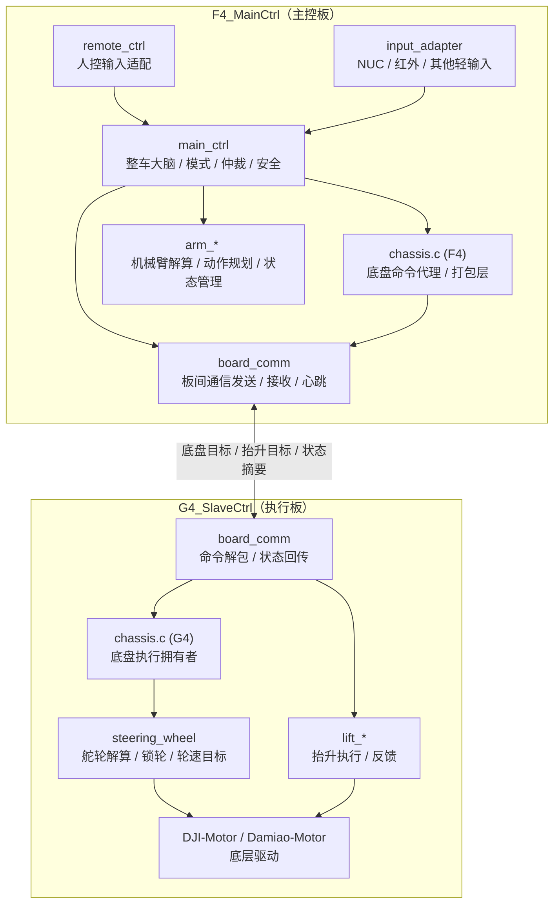
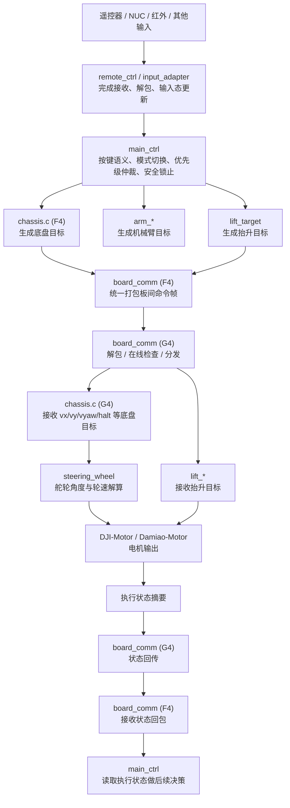
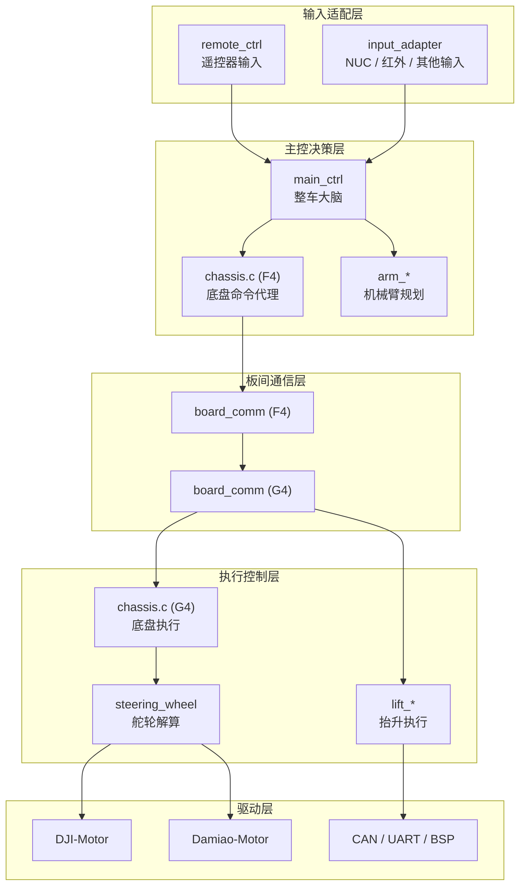

```mermaid
flowchart TB

 subgraph F4["F4_MainCtrl（主控板）"]

        RC["remote_ctrl\n人控输入适配"]

        IA["input_adapter\nNUC / 红外 / 其他轻输入"]

        MC["main_ctrl\n整车大脑 / 模式 / 仲裁 / 安全"]

        CF4["chassis.c (F4)\n底盘命令代理 / 打包层"]

        ARM["arm_* \n机械臂解算 / 动作规划 / 状态管理"]

        BCF4["board_comm\n板间通信发送 / 接收 / 心跳"]

  end

 subgraph G4["G4_SlaveCtrl（执行板）"]

        BCG4["board_comm\n命令解包 / 状态回传"]

        CG4["chassis.c (G4)\n底盘执行拥有者"]

        SW["steering_wheel\n舵轮解算 / 锁轮 / 轮速目标"]

        LIFT["lift_* \n抬升执行 / 反馈"]

        MOTOR["DJI-Motor / Damiao-Motor\n底层驱动"]

  end

    RC --> MC

    IA --> MC

    MC --> CF4 & ARM & BCF4

    CF4 --> BCF4

    BCF4 <-- 底盘目标 / 抬升目标 / 状态摘要 --> BCG4

    BCG4 --> CG4 & LIFT

    CG4 --> SW

    SW --> MOTOR

    LIFT --> MOTOR
```

```mermaid
flowchart TD
    A["遥控器 / NUC / 红外 / 其他输入"] --> B["remote_ctrl / input_adapter\n完成接收、解包、输入态更新"]
    B --> C["main_ctrl\n按键语义、模式切换、优先级仲裁、安全锁止"]
    C --> D1["chassis.c (F4)\n生成底盘目标"]
    C --> D2["arm_* \n生成机械臂目标"]
    C --> D3["lift_target\n生成抬升目标"]
    D1 --> E["board_comm (F4)\n统一打包板间命令帧"]
    D3 --> E
    E --> F["board_comm (G4)\n解包 / 在线检查 / 分发"]
    F --> G1["chassis.c (G4)\n接收 vx/vy/vyaw/halt 等底盘目标"]
    F --> G2["lift_* \n接收抬升目标"]
    G1 --> H["steering_wheel\n舵轮角度与轮速解算"]
    H --> I["DJI-Motor / Damiao-Motor\n电机输出"]
    G2 --> I
    I --> J["执行状态摘要"]
    J --> K["board_comm (G4)\n状态回传"]
    K --> L["board_comm (F4)\n接收状态回包"]
    L --> M["main_ctrl\n读取执行状态做后续决策"]
```

```mermaid
flowchart TB
    subgraph INPUT["输入适配层"]
        R1["remote_ctrl\n遥控器输入"]
        R2["input_adapter\nNUC / 红外 / 其他输入"]
    end

    subgraph DECIDE["主控决策层"]
        M1["main_ctrl\n整车大脑"]
        M2["chassis.c (F4)\n底盘命令代理"]
        M3["arm_* \n机械臂规划"]
    end

    subgraph COMM["板间通信层"]
        C1["board_comm (F4)"]
        C2["board_comm (G4)"]
    end

    subgraph EXEC["执行控制层"]
        E1["chassis.c (G4)\n底盘执行"]
        E2["steering_wheel\n舵轮解算"]
        E3["lift_* \n抬升执行"]
    end

    subgraph DRV["驱动层"]
        D1["DJI-Motor"]
        D2["Damiao-Motor"]
        D3["CAN / UART / BSP"]
    end

    R1 --> M1
    R2 --> M1
    M1 --> M2
    M1 --> M3
    M2 --> C1
    C1 --> C2
    C2 --> E1
    C2 --> E3
    E1 --> E2
    E2 --> D1
    E2 --> D2
    E3 --> D3
```

