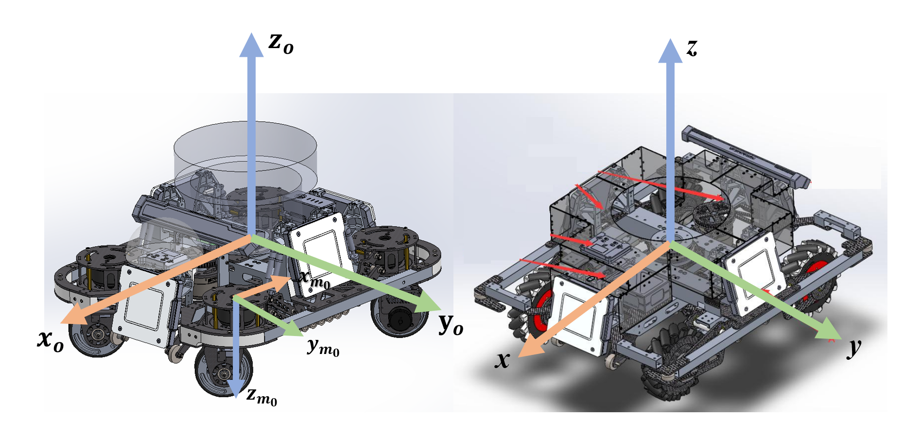
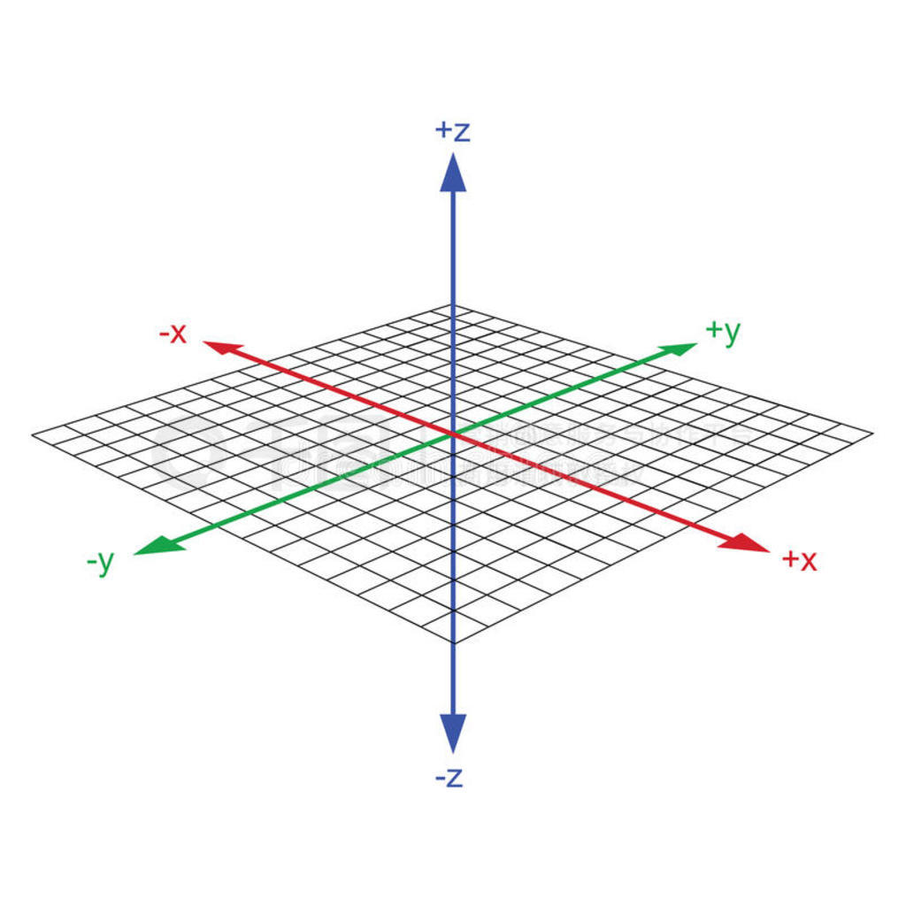

所有讨论的坐标系，全都是右手系，全都是右手系，全都是右手系！

底盘运动学解算中，按照主流的业界惯例和标准，**向前通常是 X 轴**。
机器人学与 ROS 标准（REP 103）中，
- **X 轴**：正前方 (Forward)
- **Y 轴**：正左方 (Left)
- **Z 轴**：正上方 (Up)

在这种坐标系下，底盘的运动学变量通常表示为：

- 前进线速度：$vx$
- 横向平移速度（针对全向轮或麦克纳姆轮底盘）：$vy$
- 绕中心旋转的角速度（偏航角速度）：$ωz$

*图片取自 HELLO WORLD 战队知识库，仅作学习交流使用，如有侵权可联系作者删除*

但是大多数人想象中的坐标轴其实是这样的：
X 轴向右，Y 轴向上，Z 轴垂直纸面向外的标准数学笛卡尔坐标系。

