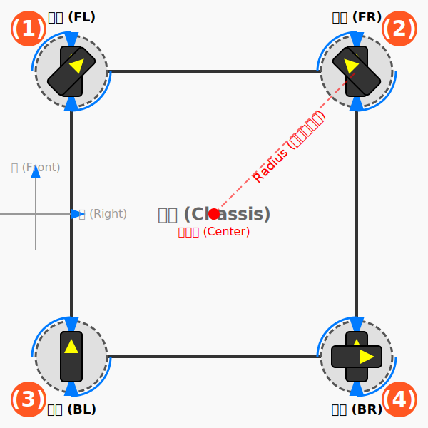
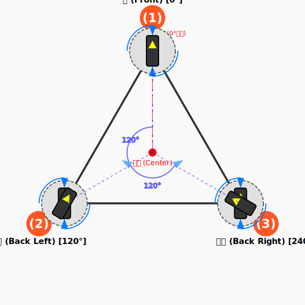

# 底盘解算

本文档详细介绍机器人底盘的运动学解算方法，包括麦克纳姆轮、全向轮和舵轮三种常见底盘类型。

---

## 1. 理论基础

### 1.1 坐标系定义
> **配图需求：1张图**
> - 机器人坐标系与世界坐标系的定义与转换关系
> - 标注：机器人前进方向为+X，左侧为+Y，逆时针旋转为+ω
>
> **图片内容详细描述**：
> 1. **机器人坐标系（局部坐标系）**
>    - 原点：机器人几何中心
>    - X轴（红色）：指向机器人正前方，标注"前进方向 +X"
>    - Y轴（绿色）：指向机器人左侧，标注"左侧 +Y"
>    - Z轴（蓝色）：垂直向上，符合右手定则
>    - 在机器人轮廓内绘制坐标系，机器人用矩形俯视图表示
>
> 2. **世界坐标系（全局坐标系）**
>    - 用虚线或较细线条绘制，与机器人坐标系形成夹角θ
>    - Xw轴（深红色）：世界坐标X方向
>    - Yw轴（深绿色）：世界坐标Y方向
>    - 标注两坐标系夹角为"偏航角 θ"
>
> 3. **坐标变换关系**
>    - 用箭头标注从世界坐标系到机器人坐标系的旋转变换
>    - 标注旋转方向为逆时针（用弧形箭头表示）
>    - 添加公式标注：V_robot = R(θ) · V_world
>
> 4. **角度标注**
>    - 在机器人中心用弧形箭头标注逆时针旋转为"+ω（正角速度）"
>    - 在右侧添加角度示意图：从+X轴开始逆时针方向标注箭头
>
> **配色建议**：
> - 机器人坐标系：鲜艳颜色（红/绿/蓝）
> - 世界坐标系：较暗颜色（深红/深绿/深蓝）
> - 机器人轮廓：灰色或黑色
> - 背景：白色或浅色
>
> **图片占位符**：


### 1.2 刚体平面运动学
> **配图需求：2张图**
> - 图1：机器人瞬时速度分解（Vx, Vy, ω）
> - 图2：轮子在机器人坐标系中的安装位置向量
>
> **图1内容详细描述 - 瞬时速度分解**：
> 1. **机器人俯视图**
>    - 矩形表示机器人底盘
>    - 中心点标注为"O（质心）"
>    - 绘制X-Y坐标系
>
> 2. **速度分量标注**
>    - Vx（红色箭头）：从中心指向右侧，标注"Vx（前进速度）"
>    - Vy（绿色箭头）：从中心指向上方，标注"Vy（横移速度）"
>    - 在中心绘制圆形箭头，标注"ω（旋转角速度，逆时针为正）"
>
> 3. **速度合成**
>    - 绘制合成速度矢量V（蓝色粗箭头），从中心指向右上方
>    - 用虚线连接Vx和Vy箭头末端形成平行四边形
>    - 标注合成公式：V = √(Vx² + Vy²)，方向角 α = atan2(Vy, Vx)
>
> 4. **运动状态说明**
>    - 在图旁添加三种运动状态示例：
>      - 纯平动：仅Vx和/或Vy，ω=0
>      - 纯旋转：Vx=Vy=0，仅ω
>      - 复合运动：Vx、Vy、ω同时存在
>
> **图2内容详细描述 - 轮子安装位置向量**：
> 1. **底盘俯视图**
>    - 矩形表示机器人底盘，四个角安装轮子
>    - 中心点标注为"O"
>    - 标注轮距W（横向两轮中心距）和轴距L（纵向两轮中心距）
>
> 2. **位置向量定义**
>    - 对每个轮子i，从中心O绘制指向轮子中心的向量r_i
>    - 标注FL轮（前左）：r_1 = (-W/2, L/2)
>    - 标注FR轮（前右）：r_2 = (W/2, L/2)
>    - 标注BL轮（后左）：r_3 = (-W/2, -L/2)
>    - 标注BR轮（后右）：r_4 = (W/2, -L/2)
>
> 3. **几何参数**
>    - 在图中标注：轮距W、轴距L
>    - 计算并标注轮子到中心距离：R = √((W/2)² + (L/2)²)
>    - 标注各轮安装角度：θ_1 = atan2(L/2, -W/2) 等
>
> 4. **速度公式关联**
>    - 添加公式框：V_wheel_i = V_center + ω × r_i
>    - 用箭头说明各参数在图中的对应关系
>
> **图片占位符**：
> ```
> [图1-2占位符：瞬时速度分解示意图]
> 
>
> [图1-3占位符：轮子安装位置向量示意图]
> 
> ```

### 1.3 轮式移动机器人运动学建模基础
- 纯滚动条件与无侧滑假设
- 轮子速度与机器人速度的映射关系

---

## 2. 麦克纳姆轮（Mecanum Wheel）底盘解算
[可以前后左右平移的神器轮子 来看看是怎么做到的-麦克纳姆轮平移原理_哔哩哔哩_bilibili](https://www.bilibili.com/video/BV19W411h7if/)


### 2.1 麦轮结构与运动原理
> **配图需求：2张图**
> - 图1：麦轮45°辊子排列示意图（标注辊子角度和旋转方向）
> - 图2：单轮速度分解示意图（辊子方向的力分解）
>
> **图1内容详细描述 - 麦轮辊子排列**：
> 1. **麦轮整体视图**
>    - 绘制麦轮的圆形轮廓
>    - 在轮毂周围均匀分布8-12个辊子
>    - 每个辊子用倾斜的小矩形/圆柱表示
>
> 2. **辊子角度标注**
>    - 绘制X型布局示意图（左侧）和O型布局示意图（右侧）对比
>    - X型：辊子从轮毂中心向外呈45°角（\\方向）
>    - O型：辊子从轮毂中心向外呈-45°角（//方向）
>    - 用角度标注线明确标出45°角
>
> 3. **旋转方向示意**
>    - 用圆形箭头标注轮子主旋转方向
>    - 用直线箭头标注辊子被动旋转方向（垂直于辊子轴线）
>    - 用虚线箭头标注合力方向（45°）
>
> 4. **布局对比表**
>    - 在图下方添加小表格：
>      | 布局类型 | 辊子角度 | 适用场景 |
>      | X型 | 45° | 标准配置 |
>      | O型 | -45° | 镜像配置 |
>
> **图2内容详细描述 - 单轮速度分解**：
> 1. **麦轮侧视图**
>    - 显示轮子与地面接触点
>    - 绘制单个辊子在接触点处的放大视图
>
> 2. **速度分解**
>    - V_wheel（蓝色箭头）：轮子主旋转产生的切向速度
>    - V_roller（绿色箭头）：辊子被动旋转方向（垂直于辊子轴线）
>    - V_result（红色粗箭头）：实际运动方向（45°）
>    - 用虚线连接形成速度分解三角形
>
> 3. **力分解示意**
>    - 绘制轮子受到的地面对辊子的反作用力
>    - 分解为沿辊子方向（可滑动）和垂直于辊子方向（纯滚动）
>
> 4. **数学公式**
>    - 添加公式框：
>      - V_x = V_wheel · cos(45°) = V_wheel / √2
>      - V_y = V_wheel · sin(45°) = V_wheel / √2
>
> **图片占位符**：
> ```
> [图2-1占位符：麦轮辊子排列示意图]
> 
>
> [图2-2占位符：单轮速度分解示意图]
> 
> ```

#### 2.1.1 辊子角度对运动的影响
- 45° X型与O型布局对比

#### 2.1.2 速度产生机理
- 主动轮转速与辊子被动转动的关系

### 2.2 逆运动学（Inverse Kinematics）
> **配图需求：2张图**
> - 图1：四轮布局俯视图（标注轮子编号：FL, FR, BL, BR）
> - 图2：速度合成向量图（机器人速度与各轮速度的向量关系）
>
> **图1内容详细描述 - 四轮布局俯视图**：
> 1. **底盘轮廓**
>    - 绘制矩形表示机器人底盘
>    - 中心绘制坐标系（X向前，Y向左）
>    - 标注中心点"O"
>
> 2. **轮子位置与编号**
>    - FL（Front Left）：前左角，标注"FL (1)"
>    - FR（Front Right）：前右角，标注"FR (2)"
>    - BL（Back Left）：后左角，标注"BL (3)"
>    - BR（Back Right）：后右角，标注"BR (4)"
>    - 每个轮子用圆角矩形表示，内部标注辊子方向（45°斜线）
>
> 3. **几何参数标注**
>    - 标注轮距W（左轮与右轮中心距，横向双箭头）
>    - 标注轴距L（前轮与后轮中心距，纵向双箭头）
>    - 计算并标注半轮距a = W/2，半轴距b = L/2
>    - 标注各轮到中心距离R
>
> 4. **麦轮类型标注**
>    - FL和BR轮标注辊子方向为"\\"（45°）
>    - FR和BL轮标注辊子方向为"/"（-45°）
>    - 在图旁标注"X型布局"
>
> **图2内容详细描述 - 速度合成向量图**：
> 1. **机器人速度输入**
>    - 在中心点绘制机器人速度矢量V_robot
>    - 分解为Vx（前进）、Vy（横移）、ω（旋转）三个分量
>
> 2. **各轮速度矢量**
>    - 从每个轮子中心绘制速度矢量V_FL、V_FR、V_BL、V_BR
>    - 用不同颜色区分四个轮子的速度矢量
>
> 3. **速度合成示意**
>    - 展示平动分量：所有轮子同向
>    - 展示旋转分量：相邻轮子反向
>    - 展示合成效果：四个矢量箭头形成旋转趋势
>
> 4. **数学关系**
>    - 在图旁添加矩阵公式：
>      ```
>      [ω1]   [1  -1  (a+b)] [Vx]
>      [ω2] = [1   1 -(a+b)] [Vy]
>      [ω3]   [1   1  (a+b)] [ω ]
>      [ω4]   [1  -1 -(a+b)]
>      ```
>    - 用箭头连接矩阵元素与图中对应几何参数
>
> **图片占位符**：
> ```
> [图2-3占位符：麦轮四轮布局俯视图]
> 
>
> [图2-4占位符：速度合成向量图]
> 
> ```

#### 2.2.1 数学推导

将底盘速度 (Vx, Vy, ω) 分解到每个麦轮上，其中 a = W/2（半轮距），b = L/2（半轴距），r 为轮子半径：

$$w_1 = \frac{1}{r}(V_x - V_y + (a+b) \cdot \omega)$$

$$w_2 = \frac{1}{r}(V_x + V_y - (a+b) \cdot \omega)$$

$$w_3 = \frac{1}{r}(V_x + V_y + (a+b) \cdot \omega)$$

$$w_4 = \frac{1}{r}(V_x - V_y - (a+b) \cdot \omega)$$

- **Vx**：底盘X方向平动速度（前进方向）
- **Vy**：底盘Y方向平动速度（左侧方向）
- **ω**：底盘自转角速度（逆时针为正）
- **(a+b)**：半轮距与半轴距之和，代表轮子到底盘中心的"等效旋转臂"
- **r**：轮子半径

### 2.3 正运动学（Forward Kinematics）
> **配图需求：1张图**
> - 通过编码器数据反解机器人实际速度
>
> **图片内容详细描述 - 正运动学解算流程**：
> 1. **输入层**
>    - 左侧绘制四个矩形框，标注"编码器1~4"
>    - 每个框内标注"脉冲计数 n_i"
>    - 用箭头指向下一个处理模块
>
> 2. **轮速计算**
>    - 中间绘制处理框，标注"轮速计算"
>    - 内部公式：V_i = (n_i · 2πr) / (N · T)
>    - 其中：r=轮子半径，N=编码器分辨率，T=采样周期
>
> 3. **速度融合**
>    - 绘制融合模块，标注"最小二乘融合"
>    - 内部示意矩阵运算过程
>
> 4. **输出层**
>    - 右侧输出框标注"机器人速度"
>    - 输出三项：Vx、Vy、ω
>
> 5. **反馈回路**
>    - 用虚线箭头从输出指回输入，标注"状态估计"
>
> **图片占位符**：
> ```
> [图2-3补充占位符：正运动学解算流程图]
> 
> ```

#### 2.3.1 编码器数据融合
- 四轮速度到机器人速度的计算

#### 2.3.2 运动状态估计

### 2.4 典型运动模式分析
> **配图需求：1张图**
> - 不同运动模式下的轮速对比表/图
>
> **图片内容详细描述 - 运动模式对比图**：
> 1. **子图布局**
>    - 2×2网格布局，四个子图分别展示四种运动模式
>    - 每个子图显示底盘俯视图和四个轮子的速度方向
>
> 2. **前进模式（左上）**
>    - 底盘矩形
>    - 四个轮子都标注同向箭头（→）
>    - 标题"前进：所有轮子同向同速"
>    - 轮速：FL=+1, FR=+1, BL=+1, BR=+1
>
> 3. **横移模式（右上）**
>    - 底盘矩形
>    - FL和BR向左（←），FR和BL向右（→）
>    - 标题"横移：对角线同向"
>    - 轮速：FL=-1, FR=+1, BL=+1, BR=-1
>
> 4. **旋转模式（左下）**
>    - 底盘矩形
>    - FL和BL向后（←），FR和BR向前（→）
>    - 中心绘制旋转箭头（逆时针）
>    - 标题"旋转：左右轮反向"
>    - 轮速：FL=+1, FR=-1, BL=+1, BR=-1
>
> 5. **斜向45°模式（右下）**
>    - 底盘矩形
>    - 只有对角两个轮子转动
>    - 标题"斜向45°：对角轮同向"
>    - 轮速示例：FL=+1, FR=0, BL=0, BR=+1（右前方运动）
>
> 6. **汇总表格**
>    - 在图下方添加详细表格：

| 运动模式 | FL | FR | BL | BR | 机器人运动 |
|---------|----|----|----|----|-----------|
| 前进 | +1 | +1 | +1 | +1 | 沿+X方向平移 |
| 后退 | -1 | -1 | -1 | -1 | 沿-X方向平移 |
| 左横移 | -1 | +1 | +1 | -1 | 沿+Y方向平移 |
| 右横移 | +1 | -1 | -1 | +1 | 沿-Y方向平移 |
| 逆时针旋转 | +1 | -1 | +1 | -1 | 绕中心逆时针旋转 |
| 顺时针旋转 | -1 | +1 | -1 | +1 | 绕中心顺时针旋转 |
| 左前斜向 | 0 | +1 | -1 | 0 | 沿左前方45°移动 |
| 右前斜向 | +1 | 0 | 0 | +1 | 沿右前方45°移动 |

> **图片占位符**：
> ```
> [图2-5占位符：运动模式对比图]
> 
> ```

---

## 3. 全向轮（Omni Wheel）底盘解算

### 3.1 全向轮结构特点
> **配图需求：1张图**
> - 全向轮辊子垂直于主轮方向的布局示意图
>
> **图片内容详细描述 - 全向轮结构示意图**：
> 1. **全向轮整体视图**
>    - 绘制全向轮的圆形轮廓
>    - 在轮毂周围均匀分布多个辊子
>    - 与麦轮对比：辊子方向垂直于轮毂切线
>
> 2. **辊子方向标注**
>    - 用蓝色线条表示主轮轮毂
>    - 用绿色小矩形表示辊子，方向垂直于轮毂半径
>    - 标注"辊子轴线 ⊥ 轮毂切线"
>
> 3. **与麦轮对比**
>    - 左右分栏：左侧全向轮，右侧麦轮
>    - 全向轮：辊子垂直（90°）
>    - 麦轮：辊子倾斜（45°）
>    - 标注两者辊子方向差异
>
> 4. **运动自由度示意**
>    - 主轮旋转方向：切向（可驱动）
>    - 辊子被动方向：轴向（可滑动）
>    - 用箭头标注两个正交方向的运动能力
>
> **图片占位符**：
> ```
> [图3-1占位符：全向轮结构示意图]
> 
> ```

#### 3.1.1 与麦轮的区别
- 辊子方向差异
- 适用场景对比

### 3.2 三轮全向底盘（120°布局）

**坐标系与布局定义**

底盘局部坐标系：X轴向前为正，Y轴向左为正，Z轴逆时针为正。

三轮底盘由前轮为1号，逆时针定义序号：
```
              (1)
            /     \
          /         \
        /             \
      /                 \
    /                     \
  (2)----------------------(3)

坐标系：
      y
      |
      |       z轴逆时针正
      |
      |
     (0)——————————>x
```

> **配图需求：3张图**
> - 图1：120°夹角三轮布局俯视图（标注各轮位置角度）
> - 图2：单轮速度矢量分解（轮子驱动方向与辊子滑动方向）
> - 图3：三轮速度合成示意图
>
> **图1内容详细描述 - 120°三轮布局**：
> 1. **底盘俯视图**
>    - 绘制等边三角形表示底盘
>    - 中心标注"O"和坐标系（X向前，Y向左）
>
> 2. **轮子位置与角度**（所有角度均从+X轴逆时针计量）
>    - 1号轮（前方，+Y方向）：位置角 α₁ = 90°，标注"1号轮 90°"
>    - 2号轮（左后方）：位置角 α₂ = 210°，标注"2号轮 210°"
>    - 3号轮（右后方）：位置角 α₃ = 330°，标注"3号轮 330°"
>
> 3. **角度与驱动方向标注**
>    - 从中心O绘制三条虚线到各轮中心（半径方向），标注位置角
>    - 用弧形箭头和度数标注相邻轮间夹角120°
>    - 每个轮子旁用实线箭头标注**驱动方向**（垂直于半径，逆时针旋转90°）：
>      - 1号轮驱动方向：180°方向（沿-X）
>      - 2号轮驱动方向：300°方向
>      - 3号轮驱动方向：60°方向
>    - 每个轮子旁用虚线箭头标注**辊子滑动方向**（沿半径方向，自由滚动）
>
> 4. **几何参数**
>    - 标注轮子到中心距离R
>    - 标注底盘外接圆半径
>
> **图2内容详细描述 - 单轮速度矢量分解**：
> 1. **轮子局部视图**
>    - 绘制单个全向轮（以2号轮为例，位置角210°）
>    - 标注轮子中心到底盘中心的半径方向
>
> 2. **速度分解**
>    - V_drive（蓝色箭头）：主轮驱动分量，沿驱动方向 n_i = (-sin(αi), cos(αi))
>    - V_slide（橙色虚线）：辊子滑动分量，沿半径方向（自由，不产生约束力）
>
> 3. **坐标变换**
>    - 标注位置角 αi
>    - 驱动方向单位向量 n_i = (-sin(αi), cos(αi))，即位置向量逆时针旋转90°
>    - 轮速 = 底盘速度在驱动方向上的投影 + 自转贡献
>
> 4. **数学表达**
>    - V_wheel_i = (Vx, Vy) · n_i + ω·R = -Vx·sin(αi) + Vy·cos(αi) + ω·R
>
> **图3内容详细描述 - 三轮速度合成**：
> 1. **三个速度矢量**
>    - 从底盘中心O绘制目标平动速度 (Vx, Vy) 大箭头
>    - 在各轮位置，绘制自转贡献速度矢量（切向）
>
> 2. **矢量叠加**
>    - 对每个轮子：平动投影分量 + 自转分量 = 最终轮速
>    - 用颜色区分平动分量（蓝色）和自转分量（红色）
>
> 3. **合成结果**
>    - 展示三个轮子的最终速度标量值
>    - 标注正值为驱动方向正向，负值为反向
>
> 4. **矩阵表示**
>    - 在旁边添加速度分配矩阵（见3.2.2节）
>
> **图片占位符**：
> ```
> [图3-2占位符：120°三轮布局俯视图]
> 
>
> [图3-3占位符：单轮速度矢量分解图]
> 
>
> [图3-4占位符：三轮速度合成示意图]
> 
> ```

#### 3.2.1 逆运动学推导

**通用公式推导**

全向轮的驱动方向垂直于轮子到底盘中心的半径方向。设第i个轮子的位置角为 αi（从+X轴逆时针计），则：

1. **轮子位置向量**：$\vec{r}_i = R \cdot (\cos\alpha_i, \sin\alpha_i)$
2. **轮子驱动方向**（位置向量逆时针旋转90°）：$\vec{n}_i = (-\sin\alpha_i, \cos\alpha_i)$
3. **平动贡献**：底盘平动速度在驱动方向上的投影 $= (V_x, V_y) \cdot \vec{n}_i$
4. **自转贡献**：自转时各轮沿切线方向运动，切向速度 $= \omega \cdot R$

合成得到通用逆运动学公式：

$$V_{wheel\_i} = -V_x \sin\alpha_i + V_y \cos\alpha_i + \omega \cdot R$$

**三轮展开**

三轮底盘中，1号轮在前方（+Y方向），位置角分别为 α₁=90°, α₂=210°, α₃=330°：

$$V_1 = -V_x \sin 90° + V_y \cos 90° + \omega R = -V_x + \omega R$$

$$V_2 = -V_x \sin 210° + V_y \cos 210° + \omega R = \frac{1}{2}V_x - \frac{\sqrt{3}}{2}V_y + \omega R$$

$$V_3 = -V_x \sin 330° + V_y \cos 330° + \omega R = \frac{1}{2}V_x + \frac{\sqrt{3}}{2}V_y + \omega R$$

**代码实现**（`omni_wheels.c`）
```c
#if (3 == OMNI_WHEEL_NUM)
    speed_wheel[0] = -speedx + speedw;
    speed_wheel[1] = speedx * ONE_2 - speedy * SQRT3_2 + speedw;
    speed_wheel[2] = speedx * ONE_2 + speedy * SQRT3_2 + speedw;
#endif
```

其中 `ONE_2 = 0.5f`, `SQRT3_2 = 0.8660254038f`（即 √3/2）。

> 注意：代码中 `speedw` 已包含了 `ω·R` 的语义（自身坐标系下直接作为自转速度分量使用）。

#### 3.2.2 速度分配公式汇总

三轮逆运动学公式（与代码一一对应）：

$$V_1 = -V_x + \omega R$$

$$V_2 = \frac{1}{2}V_x - \frac{\sqrt{3}}{2}V_y + \omega R$$

$$V_3 = \frac{1}{2}V_x + \frac{\sqrt{3}}{2}V_y + \omega R$$

三轮恰好对应三个自由度（Vx, Vy, ωR），因此三轮系统没有运动学冗余，可由三个轮速唯一反解底盘速度。

#### 3.2.3 正运动学解算

正运动学是从各轮实际转速反解底盘速度。由逆运动学三个方程联立求解可得：

$$V_x = \frac{1}{3}(-2V_1 + V_2 + V_3)$$

$$V_y = \frac{\sqrt{3}}{3}(V_3 - V_2)$$

$$\omega R = \frac{1}{3}(V_1 + V_2 + V_3)$$

> 注意：当前代码（`omni_wheels.c`）未实现正运动学解算，仅实现了逆运动学（速度指令 → 轮速）。正运动学通常在需要里程计反馈时使用。

### 3.3 四轮全向底盘

**布局定义**

四轮底盘由前轮为1号，以横向定义序号（Z字型）：
```
      (1)--------------------(2)
       |                      |
       |                      |
       |         (O)          |
       |                      |
       |                      |
      (3)--------------------(4)

坐标系：
      y
      |
      |       z轴逆时针正
      |
      |
     (0)——————————>x
```

各轮位置角（从+X轴逆时针计）：
- 1号轮（前左）：α₁ = 135°
- 2号轮（前右）：α₂ = 45°
- 3号轮（后左）：α₃ = 225°
- 4号轮（后右）：α₄ = 315°

相邻轮间夹角为90°，四轮呈正方形布局分布在底盘四角。

> **配图需求：2张图**
> - 图1：四轮全向轮布局俯视图
> - 图2：三轮vs四轮性能对比
>
> **图1内容详细描述 - 四轮布局俯视图**：
> 1. **底盘俯视图**
>    - 绘制矩形表示底盘，中心标注"O"和坐标系（X向前，Y向左）
>
> 2. **轮子位置与编号**（Z字型编号）
>    - 1号轮（前左角）：标注"1号轮 135°"，位于第二象限
>    - 2号轮（前右角）：标注"2号轮 45°"，位于第一象限
>    - 3号轮（后左角）：标注"3号轮 225°"，位于第三象限
>    - 4号轮（后右角）：标注"4号轮 315°"，位于第四象限
>
> 3. **驱动方向标注**
>    - 从中心O绘制虚线到各轮（半径方向），标注位置角
>    - 每个轮子旁用实线箭头标注驱动方向（垂直于半径，逆时针旋转90°）：
>      - 1号轮（135°）驱动方向：225°方向（左后）
>      - 2号轮（45°）驱动方向：135°方向（左前）
>      - 3号轮（225°）驱动方向：315°方向（右后）→ 即-45°方向
>      - 4号轮（315°）驱动方向：45°方向（右前）
>    - 每个轮子的全向轮辊子方向沿半径方向绘制
>
> 4. **几何参数**
>    - 标注轮子到中心距离R
>    - 标注相邻轮间夹角90°
>
> **图2内容详细描述 - 三轮vs四轮性能对比**：
> 1. **冗余度示意**
>    - 三轮：3个轮子 = 3个自由度（Vx, Vy, ω），无冗余
>    - 四轮：4个轮子 > 3个自由度，1度冗余
>
> 2. **性能对比表**
>
>    | 特性 | 三轮 | 四轮 |
>    |------|------|------|
>    | 冗余度 | 无 | 有（1度） |
>    | 容错性 | 低 | 高 |
>    | 控制复杂度 | 低 | 中 |
>    | 牵引力 | 较小 | 较大 |
>    | 成本 | 低 | 中 |
>
> **图片占位符**：
> ```
> [图3-5占位符：四轮布局方案图]
> 
>
> [图3-补充占位符：三轮四轮性能对比图]
> 
> ```

#### 3.3.1 逆运动学推导

将通用公式 $V_{wheel\_i} = -V_x \sin\alpha_i + V_y \cos\alpha_i + \omega R$ 代入四轮位置角：

$$V_1 = -V_x \sin 135° + V_y \cos 135° + \omega R = -\frac{\sqrt{2}}{2}V_x - \frac{\sqrt{2}}{2}V_y + \omega R$$

$$V_2 = -V_x \sin 45° + V_y \cos 45° + \omega R = -\frac{\sqrt{2}}{2}V_x + \frac{\sqrt{2}}{2}V_y + \omega R$$

$$V_3 = -V_x \sin 225° + V_y \cos 225° + \omega R = \frac{\sqrt{2}}{2}V_x - \frac{\sqrt{2}}{2}V_y + \omega R$$

$$V_4 = -V_x \sin 315° + V_y \cos 315° + \omega R = \frac{\sqrt{2}}{2}V_x + \frac{\sqrt{2}}{2}V_y + \omega R$$

**速度分配公式汇总**

$$V_1 = -\frac{\sqrt{2}}{2}V_x - \frac{\sqrt{2}}{2}V_y + \omega R$$

$$V_2 = -\frac{\sqrt{2}}{2}V_x + \frac{\sqrt{2}}{2}V_y + \omega R$$

$$V_3 = \frac{\sqrt{2}}{2}V_x - \frac{\sqrt{2}}{2}V_y + \omega R$$

$$V_4 = \frac{\sqrt{2}}{2}V_x + \frac{\sqrt{2}}{2}V_y + \omega R$$

**代码实现**（`omni_wheels.c`）
```c
#elif (4 == OMNI_WHEEL_NUM)
    speed_wheel[0] = -speedx * SQRT2_2 - speedy * SQRT2_2 + speedw;
    speed_wheel[1] = -speedx * SQRT2_2 + speedy * SQRT2_2 + speedw;
    speed_wheel[2] =  speedx * SQRT2_2 - speedy * SQRT2_2 + speedw;
    speed_wheel[3] =  speedx * SQRT2_2 + speedy * SQRT2_2 + speedw;
#endif
```

其中 `SQRT2_2 = 0.7071067812f`（即 √2/2）。

#### 3.3.2 正运动学（最小二乘法）

四轮系统有4个方程、3个未知数，属于超定方程组。对四轮速度取最小二乘融合，等价于利用对称轮的冗余信息取均值：

$$V_x = \frac{\sqrt{2}}{4}(-V_1 - V_2 + V_3 + V_4)$$

$$V_y = \frac{\sqrt{2}}{4}(-V_1 + V_2 - V_3 + V_4)$$

$$\omega R = \frac{1}{4}(V_1 + V_2 + V_3 + V_4)$$

这能有效抑制单轮测量噪声。

#### 3.3.3 冗余设计优势
- 超定方程组天然支持最小二乘融合，提高测量鲁棒性
- 单轮打滑或故障时，仍可通过剩余三轮近似解算
- 四轮布局提供更大的牵引力和更好的稳定性

### 3.4 世界坐标系变换

全向轮底盘支持两种坐标系模式：

**自身坐标系（默认）**：速度指令基于机器人自身方向，机器人转向后前进方向随之改变。

**世界坐标系**：速度指令基于世界固定方向，无论机器人朝向如何，"前进"始终指向世界坐标的+X方向。

当启用世界坐标系时，需要将世界坐标系下的目标速度转换为车身坐标系下的速度：

$$V_{body\_x} = V_{world\_x} \cdot \cos\theta + V_{world\_y} \cdot \sin\theta$$

$$V_{body\_y} = -V_{world\_x} \cdot \sin\theta + V_{world\_y} \cdot \cos\theta$$

其中 θ 为车身相对世界坐标系的偏航角（yaw），单位为弧度。

**代码实现**（`omni_wheels.c`）
```c
if (world_coordinate) {
    /* 如果开启世界坐标 */
    speedx = COS_F32(world_angle_rad) * target_speedx +
             SIN_F32(world_angle_rad) * target_speedy;
    speedy = -SIN_F32(world_angle_rad) * target_speedx +
             COS_F32(world_angle_rad) * target_speedy;
    speedw = target_speedw * OMNI_RADIU;
} else {
    /* 如果关闭世界坐标 */
    speedx = target_speedx;
    speedy = target_speedy;
    speedw = target_speedw;
}
```

> 注意：世界坐标系模式下，`speedw` 乘以了 `OMNI_RADIU`（轮子到中心距离），将角速度转换为线速度量纲。自身坐标系模式下直接使用原始值。

### 3.5 代码实现与API

#### 3.5.1 头文件定义（`omni_wheels.h`）

```c
#define OMNI_WHEEL_NUM 4        /* 轮子数量：3 或 4，编译时选择 */
#define OMNI_RADIU     1.0f     /* 轮子到中心距离（单位：m），需根据实际硬件修改 */

/* 全向轮底盘电机控制函数指针 */
typedef void (*omni_single_wheel_ctrl_t)(float /* speed */[]);
```

数学库支持 ARM DSP 优化或标准C数学库：
```c
#ifdef USE_ARM_MATH
#include "arm_math.h"
#define SIN_F32(x)  arm_sin_f32(x)
#define COS_F32(x)  arm_cos_f32(x)
#else
#include <math.h>
#define SIN_F32(x)  sinf(x)
#define COS_F32(x)  cosf(x)
#endif
```

#### 3.5.2 初始化函数

```c
/**
 * @brief 全向轮底盘初始化
 *
 * @param wheel_ctrl  电机控制函数指针，接收各轮转速数组
 * @param yaw_angle   世界坐标系下的偏航角指针，范围 [-π, +π]
 * @param coordinate  坐标系选择：true=世界坐标，false=自身坐标
 */
void omni_wheel_init(omni_single_wheel_ctrl_t wheel_ctrl,
                     float *yaw_angle, bool coordinate);
```

#### 3.5.3 控制函数

```c
/**
 * @brief 全向轮底盘速度控制
 *
 * @param target_speedx 目标速度x（前进方向）
 * @param target_speedy 目标速度y（左侧方向）
 * @param target_speedw 目标自转速度w（逆时针为正）
 */
void omni_wheel_ctrl(float target_speedx, float target_speedy,
                     float target_speedw);
```

内部流程：
1. 如果启用世界坐标系，通过旋转矩阵将目标速度转换为车身坐标系
2. 根据 `OMNI_WHEEL_NUM` 宏（3或4），计算各轮目标转速
3. 调用电机控制函数指针发送控制指令

#### 3.5.4 坐标系管理

```c
void omni_set_world_coordinate(void);   /* 切换到世界坐标系 */
void omni_set_self_coordinate(void);    /* 切换到自身坐标系 */
bool omni_is_world_coordinate(void);    /* 查询当前坐标系模式 */
```

### 3.6 运动特性分析
- 各向同性运动能力：三轮和四轮全向底盘在平面内具备各向同性运动能力（可向任意方向平移+旋转）
- 效率与稳定性权衡：辊子滑动方向不提供驱动力，部分能量用于克服辊子被动滚动阻力
- 三轮系统结构最简但无冗余，四轮系统增加一个冗余自由度，提高鲁棒性和牵引力

---

## 4. 舵轮（Swerve Drive）底盘解算

### 4.1 舵轮结构与原理
> **配图需求：2张图**
> - 图1：舵轮模块爆炸图/剖面图（转向电机+驱动电机+编码器）
> - 图2：舵轮速度矢量图（转向角度α与轮速V的关系）
>
> **图片描述-图1**：展示舵轮模块的内部结构，包括转向电机（航向电机）、驱动电机（舵向电机）、编码器和减速机构的装配关系。标注各部件名称和功能。
>
> **图片描述-图2**：显示舵轮的速度矢量分解，轮子可以以任意角度θ指向，速度大小为V。标注：转向角度θ、轮速V矢量、X/Y轴分量。

```
[图1占位符：舵轮模块结构示意图]


[图2占位符：舵轮速度矢量图]

```

#### 4.1.1 双电机协同控制
舵轮底盘采用双电机独立控制架构：

**舵向电机（转向电机）**
- 功能：控制轮子的朝向角度
- 控制目标：将轮子转动到目标角度θ
- 反馈：编码器实时反馈当前角度，范围 [0, 2π] rad

**航向电机（驱动电机）**
- 功能：控制轮子的转速
- 控制目标：提供目标速度V
- 特点：速度方向始终与轮子朝向一致

**底盘解算句柄**

代码通过一个静态结构体管理所有舵轮状态：
```c
static struct {
    float radius;                           /* 轮子到中心的距离 */
    float *world_angle;                     /* 世界坐标的角度指针 */
    bool halt;                              /* 是否驻停 */
    float set_wheel_angle[WHEEL_NUM];       /* 设置的轮子角度 */
    float set_wheel_speed[WHEEL_NUM];       /* 设置的轮子速度 */
    float *steering_wheel_angle[WHEEL_NUM]; /* 每个舵向电机当前的角度 */
    steering_direction_ctrl_t steering_direction_ctrl; /* 舵向电机控制函数 */
    steering_speed_ctrl_t steering_speed_ctrl;         /* 航向电机控制函数 */
} steering_ctrl_handle;
```

**初始化函数**

```c
/**
 * @param chassis_radius 轮子到中心的距离, 单位 m
 * @param world_angle    车身相对于世界坐标的角度指针 (yaw), 范围 [-180, +180] DEG
 * @param direction_ctrl 舵向电机控制函数指针
 * @param speed_ctrl     航向电机控制函数指针
 * @param steering_motor_real_angle 舵向电机角度指针, 范围 [0, 2π] RAD
 */
void steering_wheel_init(float chassis_radius, float *world_angle,
                         const steering_direction_ctrl_t direction_ctrl,
                         const steering_speed_ctrl_t speed_ctrl,
                         float *steering_motor_real_angle[]);
```

轮数通过宏定义切换，支持三轮和四轮：
```c
#define WHEEL_NUM 3  /* 或 4，与底盘实际配置保持一致 */
```

#### 4.1.2 底盘布局定义

**四轮底盘布局（Z字型编号）**
> **配图需求：1张图**
> - 四轮布局俯视图，标注轮子编号1-4
>
> **图片描述**：俯视图显示矩形底盘，四个角安装舵轮。编号规则：前轮左侧为1号，横向Z字形编号（1-2-3-4）。标注：机器人前进方向为+X，左侧为+Y。




```
布局示意图（俯视图）：
       (1)------------------(2)
        |                    |
        |       底盘         |
        |     (中心点)       |
        |                    |
       (3)------------------(4)

编号规则：
- 1号轮：前左（Z字形起点）
- 2号轮：前右
- 3号轮：后左
- 4号轮：后右
- 轮子位置：距中心距离为 radius
```

**三轮底盘布局（逆时针编号）**
> **配图需求：1张图**
> - 三轮120°布局俯视图
>
> **图片描述**：俯视图显示等边三角形布局的三个舵轮，1号轮朝前，2、3号轮呈120°分布。标注各轮安装角度（0°, 120°, 240°）。



#### 4.1.3 角度定义规范

**方向定义**
- **逆时针为正方向**：角速度ω、角度θ均遵循此约定
- **世界坐标系**：X轴朝前，Y轴朝左
- **坐标系一致性**：所有角度相关计算（角速度、theta分解）均使用逆时针为正

**航向轮电机零点校准**
- 使用DJI 3508电机作为航向轮时，统一将电机"屁股"朝左（俯视图）设为0度
- 这样可以保证各轮角度读数的一致性

**角度空间映射**

舵向电机角度解算采用极坐标映射方式（`steering_wheel.c` line 237-240）：
```c
/* 舵向电机角度解算 (极坐标映射) */
wheel_angle[i] = mix_x[i] < 0
                     ? ACOS_F32(mix_y[i] / wheel_speed[i])
                     : -ACOS_F32(mix_y[i] / wheel_speed[i]);
```

**角度空间特点**：
- **范围**：[-π, π]
- **跳变点**：在正X轴方向（angle=0）角度符号变化
- **逆时针方向**：从0°开始，逆时针旋转角度增大到+π
- **顺时针方向**：从0°开始，顺时针旋转角度减小到-π
- **连续性**：在左半平面（mix_x < 0）角度为正，右半平面（mix_x ≥ 0）角度为负或零

**角度重映射函数（`steering_wheel.c` line 106-112）**
```c
/**
 * @brief 角度重映射函数，将角度映射到定义域 [-pi, pi]
 * @param input 需要映射角度
 * @return 映射后的角度
 */
static float remap(float input) {
    input = fmod(input, 2 * PI);
    if (my_fabs(input) > PI) {
        input = input > 0 ? (input - 2 * PI) : (input + 2 * PI);
    }
    return input;
}
```

**目的**：将任意角度映射到[-π, π]主值区间，便于最小转角计算

### 4.2 逆运动学算法
> **配图需求：4张图**
> - 图1：目标速度到各舵轮速度映射流程图
> - 图2：最优转角选择示意图（处理±180°转向优化）
> - 图3：底盘几何参数标注图（轮距、轴距、中心偏移）
> - 图4：矢量叠加原理示意图
>
> **图片描述-图1**：流程图展示从输入速度(speedx, speedy, speedw)到输出轮速和转角的处理流程，包括坐标变换、自转速度分解、矢量合成、角度计算等步骤。
>
> **图片描述-图2**：展示舵轮角度选择策略，θ为计算目标角度，re_θ为相反方向角度。图中显示当前角度wheel_dir、两种选择路径，标注选择较小角度的逻辑。
>
> **图片描述-图3**：底盘俯视图标注几何参数，包括轮距（横向轮子间距）、轴距（纵向轮子间距）、轮子到中心距离radius。
>
> **图片描述-图4**：矢量合成示意图，显示平动速度矢量与自转分解速度矢量的叠加过程，得到最终合成速度矢量。

```
[图1占位符：逆运动学解算流程图]


[图2占位符：最优转角选择示意图]


[图3占位符：底盘几何参数标注图]


[图4占位符：矢量叠加原理示意图]

```

#### 4.2.1 解算核心思想

舵轮解算遵循以下核心原则：

1. **矢量叠加原理**：速度视为向量，有方向和大小，服从矢量叠加原理
2. **分解求解**：先解决平动，再搞定转动，最后合成
3. **主控只算目标值**：主控计算目标角度和速度，具体PID控制交由各轮芯片完成
4. **世界坐标转换**：支持世界坐标系与机器人坐标系的速度转换

#### 4.2.2 速度矢量合成

**核心解算函数签名**
```c
void steering_wheel_ctrl(float speedx, float speedy, float speedw);
```

**输入参数**
- `speedx`：X方向速度（机器人坐标系）
- `speedy`：Y方向速度（机器人坐标系）
- `speedw`：自转角速度（逆时针为正）

**局部变量定义**

```c
static float mix_x[WHEEL_NUM] = {0};    /* 自身坐标系下x方向上的合速度 */
static float mix_y[WHEEL_NUM] = {0};    /* 自身坐标系下y方向上的合速度 */
static float speed_wx[WHEEL_NUM] = {0}; /* 自转速度分解到自身坐标系x轴上 */
static float speed_wy[WHEEL_NUM] = {0}; /* 自转速度分解到自身坐标系y轴上 */

static float wheel_angle[WHEEL_NUM] = {0}; /* 轮子的角度 */
static float wheel_speed[WHEEL_NUM] = {0}; /* 轮子的速度 */

static float Vx = 0.0f; /* 底盘世界坐标系x方向合速度 */
static float Vy = 0.0f; /* 底盘世界坐标系y方向合速度 */
```

**Step 1: 坐标系转换准备**
```c
/* 偏转角：世界坐标系角度取反后转为弧度 */
float steering_select_yaw_angle = DEG2RAD(
    -(*steering_ctrl_handle.world_angle));

/* 注意航向轮是反着装的, 根据车辆装载可能需要修改此处 */
Vx = speedx;
Vy = -speedy;
```

**Step 2: 自转速度分解**

四轮布局（Z字形编号）的自转速度分量：
```c
/* 将自转速度分解到每个舵轮的X,Y方向上，
 * 后面与平动矢量叠加，逆时针方向为自旋的正方向。 */
speed_wx[0] = speedw * COS_F32(PI / 4);
speed_wx[1] = speedw * COS_F32(PI / 4);
speed_wx[2] = speedw * -COS_F32(PI / 4);
speed_wx[3] = speedw * -COS_F32(PI / 4);

speed_wy[0] = speedw * -SIN_F32(PI / 4);
speed_wy[1] = speedw * SIN_F32(PI / 4);
speed_wy[2] = speedw * -SIN_F32(PI / 4);
speed_wy[3] = speedw * SIN_F32(PI / 4);
```

**几何解释**：四轮呈正方形布局时，各轮到中心连线与X轴夹角为±45°。自转时各轮速度方向垂直于该轮到中心的连线（切线方向），因此用 cos(π/4) 和 sin(π/4) 分解到X、Y分量。1、2号轮（前轮）在X方向切线分量为正，3、4号轮（后轮）为负；Y方向上1、3号轮（左侧）分量为负，2、4号轮（右侧）为正。

三轮布局（120°分布）的自转速度分量：
```c
speed_wx[0] = speedw * COS_F32(0);
speed_wx[1] = speedw * -COS_F32(PI / 3);
speed_wx[2] = speedw * -COS_F32(-PI / 3);

speed_wy[0] = speedw * -SIN_F32(0);
speed_wy[1] = speedw * -SIN_F32(PI / 3);
speed_wy[2] = speedw * -SIN_F32(-PI / 3);
```

**几何解释**：三轮呈120°分布，1号轮朝前（0°），2号轮朝左后（120°），3号轮朝右后（240°/-60°）。各轮自转速度方向垂直于该轮到中心的连线，形成逆时针切向。

**Step 3: 三分支控制逻辑**

代码根据底盘状态进入不同分支：

```c
/* 分支1: 驻停锁死 */
if (steering_ctrl_handle.halt) {
    /* 轮子转到X形锁定位置，速度清零（详见4.2.5节） */
}
/* 分支2: 有速度输入时执行完整解算 */
else if ((math_compare_float(speedx, 0.0f) != MATH_FP_EQUATION) ||
         (math_compare_float(speedy, 0.0f) != MATH_FP_EQUATION) ||
         (math_compare_float(speedw, 0.0f) != MATH_FP_EQUATION)) {

    for (uint32_t i = 0; i < WHEEL_NUM; i++) {
        /* 速度分解并合成：平动坐标变换 + 自转分解 */
        mix_x[i] = Vx * COS_F32(steering_select_yaw_angle) +
                   Vy * SIN_F32(steering_select_yaw_angle) + speed_wx[i];
        mix_y[i] = Vy * COS_F32(steering_select_yaw_angle) -
                   Vx * SIN_F32(steering_select_yaw_angle) + speed_wy[i];

        /* 航向电机转速解算 */
        wheel_speed[i] = sqrt(pow(mix_x[i], 2) + pow(mix_y[i], 2));

        /* 舵向电机角度解算 (极坐标映射) */
        wheel_angle[i] = mix_x[i] < 0
                             ? ACOS_F32(mix_y[i] / wheel_speed[i])
                             : -ACOS_F32(mix_y[i] / wheel_speed[i]);
    }
}
/* 分支3: 速度为零但未驻停，仅停止驱动，保持当前角度 */
else {
    for (uint32_t i = 0; i < WHEEL_NUM; i++) {
        wheel_speed[i] = 0.0f;
    }
}
```

> **注意**：`math_compare_float` 用于浮点数相等判断，避免直接用 `==` 比较浮点数。分支3的作用是：当速度归零时保持轮子朝向不变，避免角度跳变。

**Step 4: 单轮优化 + 电机控制**
```c
/* 对每个轮子执行最小转角优化（详见4.2.4节） */
for (uint32_t i = 0; i < WHEEL_NUM; i++) {
    steering_wheel_single_ctrl(i, wheel_speed[i], wheel_angle[i]);
}

/* 统一发送控制指令 */
steering_ctrl_handle.steering_direction_ctrl(
    steering_ctrl_handle.set_wheel_angle);
steering_ctrl_handle.steering_speed_ctrl(
    steering_ctrl_handle.set_wheel_speed);
```

**矢量合成公式说明**

`mix_x` 和 `mix_y` 的计算本质是两步操作合并在一个公式中：
- **前两项**是将机器人坐标系下的平动速度 (Vx, Vy) 通过坐标旋转变换到世界坐标系：

$$V_{world\_x} = V_x \cdot \cos\theta + V_y \cdot \sin\theta$$

$$V_{world\_y} = -V_x \cdot \sin\theta + V_y \cdot \cos\theta$$

- **第三项** `speed_wx[i]` / `speed_wy[i]` 是自转速度分解到各轮的分量

#### 4.2.3 轮速与转角计算

轮速与转角的计算已包含在上一节 Step 3 的合成循环中，这里单独说明其原理：

**轮速计算**
```c
/* 矢量模长即为轮速 */
wheel_speed[i] = sqrt(pow(mix_x[i], 2) + pow(mix_y[i], 2));
```

**转角计算（极坐标映射）**
```c
/*
 * 这里的所映射到的角度空间是一个和全场定位陀螺仪一样的角度空间,
 * 逆时针从 0 开始一直增大到 PI, 经过一个跳变点到 -PI, 随后逐渐增大到 0
 * 这样处理后一圈内所有角度都会有一个值与之一一对应
 * 各轮子的角度空间也是这样的
 */
wheel_angle[i] = mix_x[i] < 0
                     ? ACOS_F32(mix_y[i] / wheel_speed[i])
                     : -ACOS_F32(mix_y[i] / wheel_speed[i]);
```

**原理说明**：
- `acos(mix_y / speed)` 返回值范围为 [0, π]
- 当 `mix_x < 0`（左半平面），角度为正值 [0, π]
- 当 `mix_x ≥ 0`（右半平面），取负值得 [-π, 0]
- 最终角度范围覆盖 [-π, π]，与一圈内的所有方向一一对应

#### 4.2.4 最小转角优化算法

**问题描述**
舵轮可以转向±180°，但应选择最短路径到达目标角度，同时考虑是否反向驱动更优。

**算法实现**
```c
/**
 * @brief 单个舵轮最小转角解算, 求解航向轮旋转角度, 以及航向轮的实际速度
 *
 * @param num   轮子编号
 * @param V     航向轮的转速
 * @param theta 舵向轮在世界坐标系下需要偏转的角度
 */
void steering_wheel_single_ctrl(uint8_t num, float V, float theta) {
    /* 轮子的角度, 作为中间量 */
    static float wheel_dir[WHEEL_NUM] = {0};

    /**
     * @var re_theta        与theta相反方向对应的角度
     * @var diff_theta      舵向轮转到theta还需要转动的角度
     * @var diff_re_theta   舵向轮转到re_theta需要转动的角度
     */
    float re_theta = 0, diff_theta = 0, diff_re_theta = 0;

    /* 获取当前舵向电机的实际角度 */
    wheel_dir[num] = *(steering_ctrl_handle.steering_wheel_angle[num]);

    /* 获得相反方向对应的角度（相差180°） */
    re_theta = theta > 0 ? theta - PI : theta + PI;

    /* 计算两种选择的转角差 */
    diff_theta = theta - wheel_dir[num];
    diff_re_theta = re_theta - wheel_dir[num];

    /* 超过定义域重新映射到 [-π, π] */
    diff_theta = remap(diff_theta);
    diff_re_theta = remap(diff_re_theta);

    /* 选择较小角度 */
    if (fabsf(diff_theta) > fabsf(diff_re_theta)) {
        /*
         * 选择相反方向：在当前位置基础上转所需角度,
         * 实际转动角度是 diff_re_theta 而不是 theta,
         * theta 只是一个绝对角度, 用于控制电机.
         */
        theta = wheel_dir[num] + diff_re_theta;
        V = -V;  /* 速度反向 */
    } else {
        /* 选择直接方向：在当前位置基础上转所需角度
         * (相当于重新投射到局部坐标系) */
        theta = wheel_dir[num] + diff_theta;
    }

    /* 写入控制句柄 */
    steering_ctrl_handle.set_wheel_speed[num] = V;
    steering_ctrl_handle.set_wheel_angle[num] = remap(theta);
}
```

**优化效果**
- 转角不超过90°，减少转向时间
- 避免大范围旋转，提高响应速度
- 通过速度反向实现等效运动

#### 4.2.5 驻停与零速模式处理

`steering_wheel_ctrl` 中有三个控制分支，除了正常解算分支外，还有两种特殊模式：

**驻停模式（halt）**

当启用驻停时，轮子自动转到锁定位置：

四轮布局驻停角度（X形锁死）：
```c
if (steering_ctrl_handle.halt) {
    wheel_angle[0] = -PI / 4;   /* 1号轮（前左）-45° */
    wheel_angle[1] = PI / 4;    /* 2号轮（前右）+45° */
    wheel_angle[2] = PI / 4;    /* 3号轮（后左）+45° */
    wheel_angle[3] = -PI / 4;   /* 4号轮（后右）-45° */

    wheel_speed[0] = 0.0f;
    wheel_speed[1] = 0.0f;
    wheel_speed[2] = 0.0f;
    wheel_speed[3] = 0.0f;
}
```

**X形锁死原理**：四个轮子朝向交叉排列，形成交叉支撑，阻止任何方向的滑动。

三轮布局驻停角度：
```c
if (steering_ctrl_handle.halt) {
    wheel_angle[0] = 0;         /* 1号轮朝前 */
    wheel_angle[1] = PI / 3;    /* 2号轮 +60° */
    wheel_angle[2] = -PI / 3;   /* 3号轮 -60° */

    wheel_speed[0] = 0.0f;
    wheel_speed[1] = 0.0f;
    wheel_speed[2] = 0.0f;
}
```

**零速停止模式**

当三个速度输入均为零且未驻停时，仅停止驱动电机，保持轮子当前朝向不变：
```c
else {
    /* 仅停止, 保持角度 */
    wheel_speed[0] = 0.0f;
    wheel_speed[1] = 0.0f;
    wheel_speed[2] = 0.0f;
    wheel_speed[3] = 0.0f;  /* 四轮时 */
}
```

> **设计意图**：与驻停模式不同，零速停止不改变轮子角度。这样在速度恢复时轮子可以立即响应，无需重新转向。

### 4.3 正运动学

正运动学是从各轮编码器反馈的实际角度和速度，反解机器人实际运动状态的过程。

**基本原理**

对于四轮舵轮底盘，每个轮子提供两个测量值：
- 舵向角度 θᵢ（编码器反馈）
- 航向速度 Vᵢ（编码器反馈）

**速度分解**

各轮速度在车身坐标系下的分量：
```c
// 第i个轮子的速度分量
V_ix = V_i * cos(θ_i)   // X方向分量（前进方向）
V_iy = V_i * sin(θ_i)   // Y方向分量（左侧方向）
```

**机器人速度合成**

由于存在测量误差和轮子打滑，采用最小二乘法融合：
```c
// 平动速度（平均各轮速度）
Vx = average(V_ix[i])   // i = 0, 1, 2, 3
Vy = average(V_iy[i])

// 自转角速度（根据各轮切向速度计算）
// 对于第i个轮子，切向速度 = V_i · sin(θ_i - α_i)
// 其中α_i为轮子安装角度
ω = sum(V_i * sin(θ_i - α_i)) / (4 * radius)
```

**与逆运动学的区别**
- 逆运动学：从目标速度 → 计算轮速/角度（开环）
- 正运动学：从实际轮速/角度 → 估计真实速度（反馈）

### 4.4 协调控制策略
> **配图需求：3张图**
> - 图1：舵轮协同运动时的矢量协调示意图
> - 图2：同步转向时序图
> - 图3：零半径旋转模式示意图
>
> **图片描述-图1**：俯视图展示四个舵轮协同运动时，各轮速度矢量如何围绕旋转中心协调排列，形成一致的旋转趋势。
>
> **图片描述-图2**：时序图展示四个舵轮转向电机到达目标角度的时间线，标注同步误差和补偿策略。
>
> **图片描述-图3**：底盘围绕自身中心点旋转的示意图，四个轮子都指向切线方向，形成纯旋转运动。

```
[图1占位符：舵轮矢量协调示意图]


[图2占位符：同步转向时序图]


[图3占位符：零半径旋转模式示意图]

```

#### 4.4.1 转向优先级分配

**同步转向控制**

为实现平滑协调运动，需要考虑各舵轮转向的同步性：

1. **最大转向速度限制**：限制转向电机最大角速度，避免某轮转动过快
2. **等待策略**：所有轮子到达目标角度范围后，才开始加速
3. **动态调整**：根据各轮当前角度与目标角度差，动态调整驱动速度

**速度归一化**

当任一舵轮达到最大速度时，需要对所有轮子速度进行等比例缩放：
```c
// 找出最大速度
max_speed = max(|wheel_speed[i]|)

// 如果超过限制，进行归一化
if (max_speed > MAX_SPEED_LIMIT) {
    scale = MAX_SPEED_LIMIT / max_speed
    for (i = 0; i < WHEEL_NUM; i++) {
        wheel_speed[i] *= scale
    }
}
```

#### 4.4.2 零半径旋转模式

**纯旋转实现**

当 speedx = 0, speedy = 0, speedw ≠ 0 时，实现原地旋转：

四轮布局零半径旋转（逆时针）：
```c
// 各轮都指向切线方向（垂直于半径）
wheel_angle[0] = -π/4   // 1号轮指向右前方（逆时针切线方向）
wheel_angle[1] = π/4    // 2号轮指向左前方（逆时针切线方向）
wheel_angle[2] = 3π/4   // 3号轮指向左后方（逆时针切线方向）
wheel_angle[3] = -3π/4  // 4号轮指向右后方（逆时针切线方向）

// 各轮速度大小与到中心距离成正比
wheel_speed[i] = speedw * radius
```

**注意**：零半径旋转时各轮角度与驻停模式不同，都指向逆时针旋转的切线方向

**旋转中心可变**

通过调整各轮角度和速度，可实现绕任意点旋转：
```c
// 绕点 (x, y) 以速度 v 旋转
// 计算各轮到旋转点的距离和角度
for (i = 0; i < WHEEL_NUM; i++) {
    dx = wheel_x[i] - x
    dy = wheel_y[i] - y
    distance = sqrt(dx² + dy²)

    // 轮子指向垂直于半径的切线方向
    wheel_angle[i] = atan2(dy, dx) + π/2

    // 速度与到旋转点距离成正比
    wheel_speed[i] = v * distance / R_center
}
```

---

## 5. 控制实现与优化

### 5.1 软件架构设计
> **配图需求：2张图**
> - 图1：底盘控制软件架构图（输入→解算→输出→反馈）
> - 图2：舵轮控制数据流图
>
> **图片描述-图1**：分层架构图，从上至下依次为：遥控器/导航层、运动学解算层、电机控制层。标注各层之间的数据接口和控制信号流向。
>
> **图片描述-图2**：数据流图展示从速度指令输入，经过坐标变换、矢量合成、角度优化，到最终电机控制输出的完整数据流程。

```
[图1占位符：底盘控制软件架构图]


[图2占位符：舵轮控制数据流图]

```

#### 5.1.1 分层控制结构

舵轮底盘控制采用三层架构：

**上层：指令输入层**
- 遥控器信号接收
- 自动导航路径规划输出
- 速度指令：speedx, speedy, speedw
- 世界坐标系角度：world_angle

**中层：运动学解算层**
```c
/* 核心解算函数 */
void steering_wheel_ctrl(float speedx, float speedy, float speedw);
```
- 坐标变换（世界坐标系 ↔ 机器人坐标系）
- 自转速度分解到各轮
- 速度矢量合成（平动+自转）
- 轮速和转角计算
- 最小转角优化
- 输出各轮目标角度和速度

**下层：电机控制层**
```c
/* 控制函数指针类型定义 */
typedef void (*steering_direction_ctrl_t)(float * /* angle */);
typedef void (*steering_speed_ctrl_t)(float * /* speed */);
```
- 舵向电机角度控制（接收 `set_wheel_angle` 数组）
- 航向电机速度控制（接收 `set_wheel_speed` 数组）
- 编码器反馈读取（舵向电机角度，范围 [0, 2π] rad）

#### 5.1.2 实时性考虑

**解算周期**
- 推荐周期：1-10ms
- 舵轮解算计算量适中，可在主循环中执行

**通信延迟优化**
- 主控只发送目标角度和速度
- 各轮PID控制由轮载芯片独立完成
- 减少主控与电机驱动器通信负担

**控制时序**
```
时间线：
|--- 读取编码器 ---|--- 运动学解算 ---|--- 发送控制指令 ---|--- PID控制(轮载) ---|
    (1ms)              (2ms)               (1ms)              (轮载芯片执行)
```

### 5.2 运动控制算法
> **配图需求：1张图**
> - PID+前馈控制框图
>
> **图片内容详细描述 - PID+前馈控制框图**：
> 1. **框图整体结构**
>    - 从左到右：输入 → 求和点 → PID控制器 → 前馈补偿 → 被控对象 → 输出 → 反馈
>
> 2. **输入部分**
>    - 目标速度 V_ref（左侧输入箭头）
>    - 标注"目标速度"
>
> 3. **反馈回路**
>    - 从输出引出反馈线
>    - 经过编码器/传感器模块
>    - 实际速度 V_actual 反馈到求和点
>
> 4. **PID控制器**
>    - 绘制PID方框
>    - 内部分三个支路：P（比例）、I（积分）、D（微分）
>    - 公式标注：u_pid = Kp·e + Ki·∫e·dt + Kd·de/dt
>
> 5. **前馈补偿**
>    - 从输入V_ref引出前馈支路
>    - 前馈模块标注：摩擦力补偿 + 加速度前馈
>    - 公式：u_ff = F_friction + m·a_ref
>
> 6. **输出合成**
>    - 在PID输出和前馈输出处绘制求和点
>    - 总控制量：u_total = u_pid + u_ff
>
> 7. **被控对象**
>    - 绘制电机/轮子方框
>    - 内部标注：电机动力学模型
>
> 8. **扰动输入**
>    - 在电机模块上绘制扰动输入d(t)
>    - 标注：负载扰动、地面摩擦变化
>
> **图片占位符**：
> ```
> [图5-3占位符：PID+前馈控制框图]
> 
> ```

#### 5.2.1 速度环PID调参
- 各轮独立PID vs 整体协调PID

#### 5.2.2 前馈补偿
- 摩擦力补偿
- 加速度前馈

### 5.3 误差处理与鲁棒性
#### 5.3.1 机械误差补偿
- 轮子半径误差校正
- 安装角度偏差补偿

#### 5.3.2 打滑检测与恢复

### 5.4 参数整定与测试
> **配图需求：1张图（可选）**
> - 标定流程图或实际测试数据对比图

#### 5.4.1 几何参数测量
- 轮距、轴距精确测量方法

#### 5.4.2 性能测试指标
- 定位精度
- 轨迹跟踪误差
- 旋转中心稳定性

---

## 6. 对比与选型指南

### 6.1 三种底盘类型对比

| 特性 | 麦轮 | 全向轮 | 舵轮 |
|------|------|--------|------|
| 结构复杂度 | 中 | 低 | 高 |
| 控制复杂度 | 中 | 低 | 高 |
| 效率 | 中（辊子滑动损耗） | 中 | 高（纯滚动） |
| 越障能力 | 弱 | 弱 | 强 |
| 成本 | 中 | 低 | 高 |
| 适用场景 | 室内平整地面 | 轻量机器人 | 高性能要求 |

### 6.2 选型建议
- 根据应用场景、预算、性能需求选择

---

## 附录

### A. 参考公式汇总

### B. 常用单位换算

### C. 开源实现参考

### D. 图片清单

#### 第1章 理论基础
- 图1-1：坐标系定义图 —— 机器人坐标系与世界坐标系的定义与转换关系
- 图1-2：速度分解示意图 —— 机器人瞬时速度分解（Vx, Vy, ω）
- 图1-3：轮子安装位置示意图 —— 轮子在机器人坐标系中的安装位置向量

#### 第2章 麦克纳姆轮底盘解算
- 图2-1：麦轮辊子排列图 —— 麦轮45°辊子排列示意图（标注辊子角度和旋转方向）
- 图2-2：单轮速度分解图 —— 单轮速度分解示意图（辊子方向的力分解）
- 图2-3：四轮布局俯视图 —— 四轮布局俯视图（标注轮子编号：FL, FR, BL, BR）
- 图2-4：速度合成向量图 —— 速度合成向量图（机器人速度与各轮速度的向量关系）
- 图2-5：运动模式对比图 —— 不同运动模式下的轮速对比表/图

#### 第3章 全向轮底盘解算
- 图3-1：全向轮结构图 —— 全向轮辊子垂直于主轮方向的布局示意图（含与麦轮对比）
- 图3-2：120°三轮布局图 —— 三轮布局俯视图（位置角90°/210°/330°，标注驱动方向和辊子方向）
- 图3-3：速度矢量分解图 —— 单轮速度矢量分解（驱动方向投影 + 自转贡献）
- 图3-4：速度合成示意图 —— 三轮速度合成示意图（平动分量 + 自转分量叠加）
- 图3-5：四轮布局方案图 —— 四轮正方形布局俯视图（Z字型编号，位置角135°/45°/225°/315°）
- 图3-6：三轮四轮对比图 —— 三轮vs四轮性能对比（冗余度、容错性等）

#### 第4章 舵轮底盘解算
- 图4-1：舵轮模块结构图 —— 舵轮模块爆炸图/剖面图（转向电机+驱动电机+编码器）
- 图4-2：舵轮速度矢量图 —— 舵轮速度矢量图（转向角度α与轮速V的关系）
- 图4-3：四轮舵轮布局图 —— 四轮舵轮底盘布局俯视图（Z字形编号1-4）
- 图4-4：三轮舵轮布局图 —— 三轮舵轮底盘布局俯视图（120°分布）
- 图4-5：逆运动学流程图 —— 目标速度到各舵轮速度映射流程图
- 图4-6：转角优化示意图 —— 最优转角选择示意图（处理±180°转向优化）
- 图4-7：几何参数标注图 —— 底盘几何参数标注图（轮距、轴距、中心偏移）
- 图4-8：矢量叠加示意图 —— 矢量叠加原理示意图
- 图4-9：速度融合示意图 —— 多舵轮速度融合算法示意图
- 图4-10：正运动学框图 —— 正运动学解算框图
- 图4-11：矢量协调示意图 —— 舵轮协同运动时的矢量协调示意图
- 图4-12：同步时序图 —— 同步转向时序图
- 图4-13：零半径旋转图 —— 零半径旋转模式示意图

#### 第5章 控制实现与优化
- 图5-1：软件架构图 —— 底盘控制软件架构图（输入→解算→输出→反馈）
- 图5-2：数据流图 —— 舵轮控制数据流图
- 图5-3：PID控制框图 —— PID+前馈控制框图

#### 文件路径规范
```
Pictures/
└── 底盘解算/
    ├── coordinate_system.png           # 图1-1
    ├── velocity_decomposition.png      # 图1-2
    ├── wheel_position.png              # 图1-3
    ├── mecanum_roller_arrangement.png  # 图2-1
    ├── mecanum_single_wheel.png        # 图2-2
    ├── mecanum_4wheel_layout.png       # 图2-3
    ├── mecanum_vector_synthesis.png    # 图2-4
    ├── mecanum_motion_modes.png        # 图2-5
    ├── omni_wheel_structure.png        # 图3-1
    ├── omni_3wheel_layout.png          # 图3-2
    ├── omni_vector_decomposition.png   # 图3-3
    ├── omni_synthesis.png              # 图3-4
    ├── omni_4wheel_layout.png          # 图3-5
    ├── omni_3vs4_comparison.png        # 图3-6
    ├── swerve_module_structure.png     # 图4-1
    ├── swerve_velocity_vector.png      # 图4-2
    ├── swerve_4wheel_layout.png        # 图4-3
    ├── swerve_3wheel_layout.png        # 图4-4
    ├── swerve_algorithm_flow.png       # 图4-5
    ├── swerve_angle_optimization.png   # 图4-6
    ├── swerve_geometry_params.png      # 图4-7
    ├── swerve_vector_superposition.png # 图4-8
    ├── swerve_forward_kinematics_fusion.png  # 图4-9
    ├── swerve_forward_kinematics_block.png   # 图4-10
    ├── swerve_vector_coordination.png  # 图4-11
    ├── swerve_sync_timing.png          # 图4-12
    ├── swerve_point_turn.png           # 图4-13
    ├── swerve_software_architecture.png      # 图5-1
    ├── swerve_data_flow.png            # 图5-2
    └── swerve_pid_control.png          # 图5-3
```

**总计：约30张配图**

---

*文档版本：v1.0*
*最后更新：2026-02-08*
