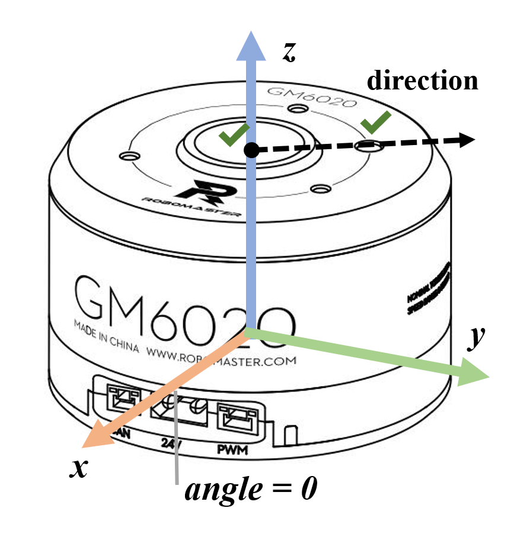

# 底盘解算

本文档详细介绍机器人底盘的运动学解算方法，包括麦克纳姆轮、全向轮和舵轮三种常见底盘类型。

---

## 1. 理论基础

### 1.1 坐标系定义
> **配图需求：1张图**
> - 机器人坐标系与世界坐标系的定义与转换关系
> - 标注：机器人前进方向为+X，左侧为+Y，逆时针旋转为+ω



### 1.2 刚体平面运动学
> **配图需求：2张图**
> - 图1：机器人瞬时速度分解（Vx, Vy, ω）
> - 图2：轮子在机器人坐标系中的安装位置向量

### 1.3 轮式移动机器人运动学建模基础
- 纯滚动条件与无侧滑假设
- 轮子速度与机器人速度的映射关系

---

## 2. 麦克纳姆轮（Mecanum Wheel）底盘解算

### 2.1 麦轮结构与运动原理
> **配图需求：2张图**
> - 图1：麦轮45°辊子排列示意图（标注辊子角度和旋转方向）
> - 图2：单轮速度分解示意图（辊子方向的力分解）

#### 2.1.1 辊子角度对运动的影响
- 45° X型与O型布局对比

#### 2.1.2 速度产生机理
- 主动轮转速与辊子被动转动的关系

### 2.2 逆运动学（Inverse Kinematics）
> **配图需求：2张图**
> - 图1：四轮布局俯视图（标注轮子编号：FL, FR, BL, BR）
> - 图2：速度合成向量图（机器人速度与各轮速度的向量关系）

#### 2.2.1 数学推导
```
轮子速度 = (Vx ± Vy ± ω·L) / r
```
- 各参数含义说明
- 符号规则约定

#### 2.2.2 速度分配矩阵
```
[w1]   [1  -1  (a+b)] [Vx]
[w2] = [1   1 -(a+b)] [Vy]
[w3]   [1   1  (a+b)] [ω ]
[w4]   [1  -1 -(a+b)]
```
- 矩阵元素与几何参数的对应关系

### 2.3 正运动学（Forward Kinematics）
> **配图需求：1张图**
> - 通过编码器数据反解机器人实际速度

#### 2.3.1 编码器数据融合
- 四轮速度到机器人速度的计算

#### 2.3.2 运动状态估计

### 2.4 典型运动模式分析
> **配图需求：1张图**
> - 不同运动模式下的轮速对比表/图

| 运动模式 | FL | FR | BL | BR |
|---------|----|----|----|----|
| 前进 | +1 | +1 | +1 | +1 |
| 横移 | -1 | +1 | +1 | -1 |
| 旋转 | +1 | -1 | +1 | -1 |
| 斜向45° | ... | ... | ... | ... |

---

## 3. 全向轮（Omni Wheel）底盘解算

### 3.1 全向轮结构特点
> **配图需求：1张图**
> - 全向轮辊子垂直于主轮方向的布局示意图

#### 3.1.1 与麦轮的区别
- 辊子方向差异
- 适用场景对比

### 3.2 三轮全向底盘（120°布局）
> **配图需求：3张图**
> - 图1：120°夹角三轮布局俯视图（标注各轮角度：0°, 120°, 240°）
> - 图2：单轮速度矢量分解（轮子坐标系到机器人坐标系）
> - 图3：三轮速度合成示意图

#### 3.2.1 逆运动学推导
```
V_wheel_i = Vx·cos(θi) + Vy·sin(θi) + ω·R
```
- θi：第i个轮子的安装角度
- R：轮子到中心距离

#### 3.2.2 速度分配矩阵（3×3）

#### 3.2.3 正运动学解算

### 3.3 四轮全向底盘
> **配图需求：2张图**
> - 图1：四轮布局方案（矩形/菱形布局）
> - 图2：与三轮布局的性能对比

#### 3.3.1 冗余设计优势
- 超定方程组的求解
- 最小二乘法融合

### 3.4 运动特性分析
- 各向同性运动能力
- 效率与稳定性权衡

---

## 4. 舵轮（Swerve Drive）底盘解算

### 4.1 舵轮结构与原理
> **配图需求：2张图**
> - 图1：舵轮模块爆炸图/剖面图（转向电机+驱动电机+编码器）
> - 图2：舵轮速度矢量图（转向角度α与轮速V的关系）

#### 4.1.1 双电机协同控制
- 转向电机：控制轮子朝向
- 驱动电机：控制轮子转速

#### 4.1.2 转向-驱动耦合关系

### 4.2 逆运动学算法
> **配图需求：3张图**
> - 图1：目标速度到各舵轮速度映射流程图
> - 图2：最优转角选择示意图（处理±180°转向优化）
> - 图3：底盘几何参数标注图（轮距、轴距、中心偏移）

#### 4.2.1 目标速度分解
```
V_i = V_robot + ω × r_i
```
- V_i：第i个舵轮需要提供的速度矢量
- r_i：轮子相对于中心的位矢

#### 4.2.2 转角计算
```
α_i = atan2(V_i_y, V_i_x)
```

#### 4.2.3 轮速计算
```
|V_wheel_i| = sqrt(V_i_x² + V_i_y²)
```

#### 4.2.4 转向优化策略
- 最短路径转角选择
- 反向旋转方案（当转角>90°时）

### 4.3 正运动学
> **配图需求：1张图**
> - 多舵轮速度融合算法示意图

#### 4.3.1 四轮速度融合
- 最小二乘法估计机器人速度
- 协方差加权融合

#### 4.3.2 打滑检测与补偿

### 4.4 协调控制策略
> **配图需求：1张图**
> - 舵轮协同运动时的矢量协调示意图

#### 4.4.1 转向优先级分配
- 同步转向控制
- 速度归一化

#### 4.4.2 零半径旋转模式

---

## 5. 控制实现与优化

### 5.1 软件架构设计
> **配图需求：1张图**
> - 底盘控制软件架构图（输入→解算→输出→反馈）

#### 5.1.1 分层控制结构
- 上层：速度指令输入（遥控/导航）
- 中层：运动学解算
- 下层：电机PID控制

#### 5.1.2 实时性考虑
- 解算周期与通信延迟

### 5.2 运动控制算法
> **配图需求：1张图**
> - PID+前馈控制框图

#### 5.2.1 速度环PID调参
- 各轮独立PID vs 整体协调PID

#### 5.2.2 前馈补偿
- 摩擦力补偿
- 加速度前馈

### 5.3 误差处理与鲁棒性
#### 5.3.1 机械误差补偿
- 轮子半径误差校正
- 安装角度偏差补偿

#### 5.3.2 打滑检测与恢复

### 5.4 参数整定与测试
> **配图需求：1张图（可选）**
> - 标定流程图或实际测试数据对比图

#### 5.4.1 几何参数测量
- 轮距、轴距精确测量方法

#### 5.4.2 性能测试指标
- 定位精度
- 轨迹跟踪误差
- 旋转中心稳定性

---

## 6. 对比与选型指南

### 6.1 三种底盘类型对比

| 特性 | 麦轮 | 全向轮 | 舵轮 |
|------|------|--------|------|
| 结构复杂度 | 中 | 低 | 高 |
| 控制复杂度 | 中 | 低 | 高 |
| 效率 | 中（辊子滑动损耗） | 中 | 高（纯滚动） |
| 越障能力 | 弱 | 弱 | 强 |
| 成本 | 中 | 低 | 高 |
| 适用场景 | 室内平整地面 | 轻量机器人 | 高性能要求 |

### 6.2 选型建议
- 根据应用场景、预算、性能需求选择

---

## 附录

### A. 参考公式汇总

### B. 常用单位换算

### C. 开源实现参考

### D. 图片清单
- 图1-1：坐标系定义图
- 图1-2：速度分解示意图
- 图1-3：轮子安装位置示意图
- 图2-1：麦轮辊子排列图
- 图2-2：单轮速度分解图
- 图2-3：四轮布局俯视图
- 图2-4：速度合成向量图
- 图2-5：运动模式对比图
- 图3-1：全向轮结构图
- 图3-2：120°三轮布局图
- 图3-3：速度矢量分解图
- 图3-4：速度合成示意图
- 图3-5：四轮布局方案图
- 图4-1：舵轮模块结构图
- 图4-2：舵轮速度矢量图
- 图4-3：速度映射流程图
- 图4-4：转角优化示意图
- 图4-5：底盘几何参数图
- 图4-6：速度融合示意图
- 图4-7：矢量协调示意图
- 图5-1：软件架构图
- 图5-2：PID控制框图

**总计：约22张配图**

---

*文档版本：v1.0*
*最后更新：2026-02-08*
