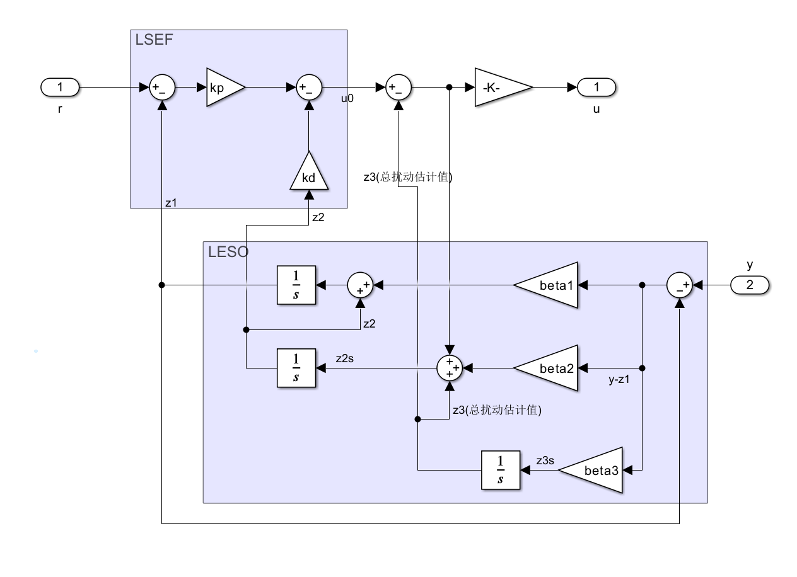

# 线性自抗扰控制（LADRC）详解

> **最近修改日期**：2026-02-06
> **参与者**：Jackrainman
> **前置知识**：[05-何谓自抗扰.md](./05-何谓自抗扰.md)

---

## 目录

1. [引言](#第一章引言)
2. [扰动响应理论](#第二章扰动响应理论)
3. [干扰观测器](#第三章干扰观测器)
4. [线性扩张状态观测器(LESO)](#第四章线性扩张状态观测器leso)
5. [LADRC控制律](#第五章ladrc控制律)
6. [离散化实现](#第六章离散化实现)
7. [参数整定](#第七章参数整定)
8. [总结](#第八章总结)

---

## 第一章：引言 {#第一章引言}

### 1.1 LADRC的诞生

自抗扰控制（ADRC）由韩京清教授于1998年提出，**将系统内外的所有不确定性打包为"总扰动"，通过扩张状态观测器（ESO）实时估计并补偿**。

原始ADRC的问题在于参数整定困难。非线性函数的选择和多个参数的调节都需要工程经验。

高志强教授（Gao Zhiqiang）于2003年提出了线性自抗扰控制（LADRC），**将参数整定问题转化为带宽调节问题**：

- **观测器带宽** $\omega_o$（Observer Bandwidth）
- **控制器带宽** $\omega_c$（Controller Bandwidth）

### 1.2 控制面临的核心挑战

实际控制系统中，我们会面对模型不确定性、外部扰动和测量噪声三类问题：

| 挑战 | 具体表现 | 传统方法的局限 |
|------|----------|----------------|
| **模型不确定性** | 参数变化、未建模动态 | PID难以自适应调整 |
| **外部扰动** | 负载突变、环境干扰 | 积分器响应滞后 |
| **测量噪声** | 传感器噪声、量化误差 | 滤波会引入相位滞后 |

LADRC的目标是在不依赖精确模型的前提下应对上述问题。

### 1.3 LADRC的核心思想

```
实时估计总扰动 → 立即补偿 → 将复杂系统转化为简单的积分器串联型
```

控制结构分为两个环：

```
┌─────────────────────────────────────────────────────────────┐
│                      LADRC 控制结构                          │
├─────────────────────────────────────────────────────────────┤
│                                                             │
│    给定 r ──→ ┌─────────┐    ┌─────────┐    ┌──────┐       │
│               │  LSEF   │───→│   u₀    │───→│      │       │
│               │(控制律) │    │(虚拟量) │    │      │       │
│               └────▲────┘    └────┬────┘    │  被  │──→ y  │
│                    │              │         │  控  │       │
│    ┌───────────┐   │         ┌────┴────┐    │  对  │       │
│    │   LESO    │───┴────────→│ u=u₀-z₃ │───→│  象  │       │
│    │(扰动估计) │              │  /b₀    │    │      │       │
│    └──────▲────┘              └─────────┘    └──────┘       │
│           │                                                 │
│           └───────────────────────────────────────┘         │
│                        输出 y                               │
│                                                             │
└─────────────────────────────────────────────────────────────┘
```



- **LESO（内环）**：估计总扰动
- **LSEF（外环）**：设计期望的动态响应

---

## 第二章：扰动响应理论 {#第二章扰动响应理论}

### 2.1 指令响应 vs 扰动响应

| 响应类型 | 定义 | 优化目标 |
|----------|------|----------|
| **指令响应** $S(s)$ | 输出对给定指令的响应 | 快速、无超调跟踪 |
| **扰动响应** $T(s)$ | 输出对扰动的响应 | 快速抑制、最小影响 |

指令响应衡量系统跟踪指令的能力，扰动响应衡量系统抗干扰的能力。

### 2.2 扰动响应的频域特性

扰动响应 $T(s)$ 定义为系统输出 $C(s)$ 对扰动输入 $D(s)$ 的传递函数：

$$
T(s) = \frac{C(s)}{D(s)}
$$

理想情况：$T(s) = 0$（扰动对输出零影响），频域表现为 $-\infty$ dB。

#### 典型控制系统的扰动响应特性

考虑一个典型的PID控制系统，扰动施加在被控对象之前：

```
     扰动 d
       │
       ▼
r ──→[C(s)]──→[P(s)]──→ y
                ▲
                └───────┘
```

**频域特性分析**：

| 频段 | 特性 | 原因 |
|------|------|------|
| **低频段** | 扰动响应好（衰减大） | 积分器作用，高增益抑制 |
| **中频段** | 扰动响应差（衰减小） | 积分器相位滞后，控制器增益有限 |
| **高频段** | 扰动响应好（衰减大） | 被控对象惯性（如电容、电感）自然滤波 |

为什么中频段表现差？类比开车：低频扰动像路面缓慢起伏，有足够时间调整方向盘（积分器起作用）；高频扰动像路面细小振动，悬挂系统自动过滤（被控对象惯性）；中频扰动像突然的坑洼，来不及反应，悬挂也来不及过滤。

### 2.3 改善扰动响应的途径

从扰动响应传递函数来看，改善扰动响应有以下方法：

#### 方法一：使用响应缓慢的被控对象

被控对象本身的低通特性（大惯量器件、大电容等）可自然滤波。

**优点**：无需额外设计。

**缺点**：
- 成本高（大惯量 = 更大、更重、更贵）
- 响应变慢（指令跟踪性能下降）

#### 方法二：增大控制器增益

提高控制器在扰动频率段的增益：

- **增大比例增益 $K_p$**：改善高频扰动响应，同时改善指令响应
- **增大积分增益 $K_i$**：改善低频扰动响应

**局限**：
- 受稳定性限制，不能无限增大
- 稳定裕度小的系统，增大增益会导致振荡甚至失稳
- 对传感器噪声更敏感

#### 方法三：扰动解耦法（LADRC的核心）

在扰动引起输出变化**之前**进行测量或估计，在功率变换器之前减去等效扰动量：

```
        d（扰动）
         │
         ▼
    ┌─────────┐     ┌─────────┐
    │ 估计器  │────→│   -d̂   │（抵消）
    │  d̂    │     └────┬────┘
    └────▲────┘          │
         │               ▼
    y ───┘         ┌─────────┐
                   │  被控   │──→ y
    r ──→[C]──────→│  对象   │
                   └─────────┘
```

**优势**：
- 不依赖被控对象的大惯性
- 不牺牲指令响应速度
- 不受稳定性增益限制

实际工程中应综合使用增大控制器增益和扰动解耦法。

### 2.4 扰动解耦法

通过扩张状态观测器（ESO）实时估计总扰动 $f$，在控制输入端抵消：

原系统：$\ddot{y} = f + bu$

补偿控制律：$u = \frac{u_0 - \hat{f}}{b}$

代入得：$\ddot{y} = f + b \cdot \frac{u_0 - \hat{f}}{b} = f - \hat{f} + u_0 \approx u_0$

估计准确时（$\hat{f} \approx f$），扰动被抵消，系统简化为纯积分器串联型。

---

## 第三章：干扰观测器 {#第三章干扰观测器}

### 3.1 总扰动的定义

$$
f = \underbrace{f_{\text{内部}}}_{\text{未建模动态、参数变化}} + \underbrace{f_{\text{外部}}}_{\text{外部干扰、负载变化}}
$$

这种打包的好处是无需区分扰动来源，统一处理所有不确定性，不需要精确模型。

### 3.2 干扰观测器概述

干扰观测器（Disturbance Observer, DOB）通过比较实际系统输出与标称模型输出，将差异归因于扰动，生成补偿信号：

```
        u ──→[对象实际]──→ y
                │
                ▼
        ┌───────────────┐
        │   对象模型    │
        │    Gn(s)     │
        └───────┬───────┘
                │
    y ◄─────────┘
         │
         ▼
    ┌─────────────┐
    │  扰动估计   │──→ 补偿信号
    └─────────────┘
```

### 3.3 ESO作为无模型干扰观测器

| 类型 | 代表方法 | 特点 |
|------|----------|------|
| **基于模型** | 传统DOB | 需要准确的对象模型 |
| **无模型** | ESO/LESO | 仅需知道系统相对阶数 |

ESO不需要准确模型，只需要系统的相对阶数（输入需要经过几次积分才能影响输出）。它将未建模动态、外部干扰、参数变化都归为总扰动一并估计，利用输出误差进行在线校正。

```
传统DOB:        ESO:
┌────────┐      ┌────────┐
│ 需要   │      │ 需要   │
│ 精确   │      │ 相对   │
│ 模型   │      │ 阶数   │
└────────┘      └────────┘
    │               │
    ▼               ▼
┌────────┐      ┌────────┐
│ 模型   │      │ 状态   │
│ 求逆   │      │ 扩张   │
└────────┘      └────────┘
```

ESO用最少的先验知识（仅相对阶数）应对最大的不确定性。

### 3.4 前馈+干扰观测器+反馈综合应用

实际工程中应综合使用三种控制策略：

```
                    ┌─────────────┐
    r ─────────────→│   前馈      │──────┐
                    │  (Feedforward) │   │
                    └─────────────┘   │
                                        ▼
                    ┌─────────────┐  ┌────────┐
                    │  反馈控制   │  │   +    │──→ u
    e = r - y ────→│  (LSEF)     │─→│        │
                    │  wc调节     │  │   +    │
                    └─────────────┘  └───┬────┘
                                         │
                    ┌─────────────┐   ┌──┴───┐
    y ─────────────→│  干扰观测器  │─→│  -   │（扰动补偿）
                    │  (LESO)     │   └──────┘
                    │  wo调节     │
                    └─────────────┘
```

| 环节 | 作用 | 信息类型 |
|------|------|----------|
| **前馈** | 加速指令响应 | 离线信息（已知指令） |
| **反馈** | 稳定跟踪、误差消除 | 在线信息（实时误差） |
| **干扰观测器** | 抑制扰动、补偿不确定性 | 在线信息（输出测量） |

前馈提供预见性，反馈提供稳定性，干扰观测器提供鲁棒性。

---

## 第四章：线性扩张状态观测器(LESO) {#第四章线性扩张状态观测器leso}

### 4.1 从ESO到LESO

原始ADRC使用**非线性扩张状态观测器（ESO）**，增益是误差的非线性函数：

$$
z_1 \rightarrow e = z_1 - y \rightarrow \text{非线性函数} \rightarrow \text{修正信号}
$$

问题在于非线性函数参数多，整定困难。高志强教授将ESO线性化，得到**线性扩张状态观测器（LESO）**：

- 结构简单，易于实现
- 参数整定转化为带宽设计
- 可利用成熟的线性系统理论分析

### 4.2 极点配置法

LESO设计将所有观测器极点配置在 $-\omega_o$。

对于 $n$ 阶系统，设计 $(n+1)$ 阶LESO，特征多项式为：

$$
\lambda(s) = (s + \omega_o)^{n+1}
$$

所有极点相同 → 响应由单一参数 $\omega_o$ 决定；$\omega_o$ 越大 → 极点越远离原点 → 响应越快。

### 4.3 二阶系统LESO设计

以二阶系统为例（如弹簧-质量-阻尼系统）：

**原系统**：
$$
\ddot{y} = f + b_0 u
$$

**扩张状态**：
- $x_1 = y$（位置）
- $x_2 = \dot{y}$（速度）
- $x_3 = f$（总扰动，扩张状态）

**扩张状态方程**：
$$
\begin{cases}
\dot{x}_1 = x_2 \\
\dot{x}_2 = x_3 + b_0 u \\
\dot{x}_3 = \dot{f} \\
y = x_1
\end{cases}
$$

**LESO方程**：
$$
\begin{cases}
\dot{z}_1 = z_2 + l_1(y - z_1) \\
\dot{z}_2 = z_3 + b_0 u + l_2(y - z_1) \\
\dot{z}_3 = l_3(y - z_1)
\end{cases}
$$

其中 $l_1, l_2, l_3$ 是观测器增益。

**极点配置**：

将观测器特征方程配置为 $(s + \omega_o)^3 = 0$，展开得：

$$
s^3 + 3\omega_o s^2 + 3\omega_o^2 s + \omega_o^3 = 0
$$

因此观测器增益为：

$$
\boxed{
\begin{aligned}
l_1 &= 3\omega_o \\
l_2 &= 3\omega_o^2 \\
l_3 &= \omega_o^3
\end{aligned}
}
$$

二阶LESO增益的系数 3, 3, 1 对应二项式 $(a+b)^3$ 的展开系数。

### 4.4 n阶系统推广

对于 $n$ 阶系统，$(n+1)$ 阶LESO的增益遵循二项式系数：

**极点配置**：$(s + \omega_o)^{n+1} = 0$

**增益公式**：

| 系统阶数 | 观测器阶数 | 增益 $l_k$ |
|:--------:|:----------:|:-----------|
| 1阶 | 2阶 | $l_1 = 2\omega_o, \quad l_2 = \omega_o^2$ |
| 2阶 | 3阶 | $l_1 = 3\omega_o, \quad l_2 = 3\omega_o^2, \quad l_3 = \omega_o^3$ |
| 3阶 | 4阶 | $l_1 = 4\omega_o, \quad l_2 = 6\omega_o^2, \quad l_3 = 4\omega_o^3, \quad l_4 = \omega_o^4$ |
| n阶 | n+1阶 | $l_k = C_{n+1}^k \cdot \omega_o^k$ |

其中 $C_{n+1}^k$ 是组合数（二项式系数）。

**通式**：

$$
l_k = \binom{n+1}{k} \omega_o^k, \quad k = 1, 2, ..., n+1
$$

### 4.5 观测器带宽$\omega_o$的选择

$\omega_o$ 决定了观测器的估计速度和噪声敏感度：

| $\omega_o$ 大小 | 估计速度 | 噪声敏感度 | 适用场景 |
|:---------------:|:--------:|:----------:|:---------|
| 较小 | 慢 | 低（滤波好） | 噪声大的环境 |
| 适中 | 适中 | 适中 | 一般工业控制 |
| 较大 | 快 | 高（噪声敏感） | 快速响应需求 |

**设计经验**：

$$
\omega_o = (3 \sim 5) \cdot \omega_c
$$

其中 $\omega_c$ 是控制器带宽。

**调试原则**：
1. 先取 $\omega_o = 4\omega_c$ 作为初始值
2. 如果估计滞后明显，增大 $\omega_o$
3. 如果噪声敏感，减小 $\omega_o$

---

## 第五章：LADRC控制律 {#第五章ladrc控制律}

### 5.1 线性误差反馈控制律(LSEF)

LSEF（Linear State Error Feedback）根据误差生成虚拟控制量 $u_0$。

对于二阶系统：

$$
u_0 = k_p(r - z_1) - k_d z_2
$$

其中：
- $r$：给定值
- $z_1$：LESO估计的位置
- $z_2$：LESO估计的速度
- $k_p, k_d$：控制器增益

### 5.2 控制器带宽$\omega_c$

LSEF同样采用带宽法，将控制器极点配置在 $-\omega_c$。

补偿后的系统近似为：$\ddot{y} \approx u_0$

期望的闭环特性：$(s + \omega_c)^2 = s^2 + 2\omega_c s + \omega_c^2 = 0$

因此：

$$
\boxed{
\begin{aligned}
k_p &= \omega_c^2 \\
k_d &= 2\omega_c
\end{aligned}
}
$$

- $k_p = \omega_c^2$：位置误差增益，决定静态精度
- $k_d = 2\omega_c$：速度反馈增益，提供阻尼，抑制超调

### 5.3 完整控制律与参数关系

**完整LADRC控制律**：

$$
u = \frac{u_0 - z_3}{b_0} = \frac{k_p(r - z_1) - k_d z_2 - z_3}{b_0}
$$

其中 $z_3$ 是LESO估计的总扰动。

**参数关系汇总**：

| 参数 | 符号 | 计算公式 | 作用 |
|------|------|----------|------|
| 观测器带宽 | $\omega_o$ | 设计参数 | 决定扰动估计速度 |
| 观测器增益 | $l_k$ | $\binom{n+1}{k}\omega_o^k$ | LESO校正强度 |
| 控制器带宽 | $\omega_c$ | 设计参数 | 决定系统响应速度 |
| 控制器增益 | $k_p, k_d$ | $\omega_c^2, 2\omega_c$ | 误差反馈强度 |
| 补偿系数 | $b_0$ | 对象特性 | 控制效率 |

**参数数量对比**：

| 控制器类型 | 需要调节的参数 |
|:----------:|:--------------:|
| PID | $K_p, K_i, K_d$（3个） |
| ADRC | 多个非线性参数 |
| **LADRC** | **$\omega_o, \omega_c, b_0$（3个）** |

LADRC将参数整定简化为调节两个带宽和一个增益系数。

---

## 第六章：离散化实现 {#第六章离散化实现}

### 6.1 为什么需要离散化

LADRC算法在计算机（DSP、MCU、PLC）上实现需要离散化：

1. 计算机只能以固定采样周期 $h$ 运行
2. 微分方程需要转化为差分方程
3. 离散算法必须在每个采样周期内完成计算

### 6.2 零阶保持器原理

**离散化方法选择**：

| 方法 | 优点 | 缺点 |
|------|------|------|
| 欧拉法 | 简单 | 相位滞后大，精度低 |
| 一阶保持 | 精度较高 | 计算复杂 |
| **零阶保持法** | **形式简单，相位滞后小** | 计算量稍大 |

**零阶保持法（ZOH）原理**：

```
连续信号 u(t)          离散信号 u(k)
    │                      │
    ▼                      ▼
┌─────────┐           ┌─────────┐
│ 零阶    │           │ 离散    │
│ 保持器  │──────────→│ 系统    │
└─────────┘           └─────────┘

ZOH将离散信号u(k)保持为
连续信号u(t)=u(k), kT≤t<(k+1)T
```

**离散化步骤**：
1. 在连续对象前串联零阶保持器
2. 对整体进行Z变换
3. 得到离散状态方程

### 6.3 一阶系统离散化推导（详细步骤）

**连续模型**：

一阶系统：$\dot{x} = f + b_0 u$

状态空间形式：
$$
\begin{cases}
\dot{x}_1 = x_2 + b_0 u \\
\dot{x}_2 = \dot{f}
\end{cases}
$$

矩阵形式：$\dot{\mathbf{x}} = A\mathbf{x} + Bu$

其中：
$$
A = \begin{bmatrix} 0 & 1 \\ 0 & 0 \end{bmatrix}, \quad B = \begin{bmatrix} b_0 \\ 0 \end{bmatrix}
$$

**添加零阶保持器后Z变换**：

离散状态方程标准形式：

$$
\mathbf{x}(k+1) = \Phi \mathbf{x}(k) + \Gamma u(k)
$$

其中：
- 状态转移矩阵：$\Phi = e^{Ah}$
- 输入矩阵：$\Gamma = \int_0^h e^{A\tau} B d\tau$

**计算 $\Phi$**：

利用矩阵指数展开：$e^{At} = I + At + \frac{(At)^2}{2!} + ...$

对于 $A = \begin{bmatrix} 0 & 1 \\ 0 & 0 \end{bmatrix}$：
- $A^2 = \begin{bmatrix} 0 & 0 \\ 0 & 0 \end{bmatrix}$（幂零矩阵）

因此：

$$
\Phi = e^{Ah} = I + Ah = \begin{bmatrix} 1 & h \\ 0 & 1 \end{bmatrix}
$$

**计算 $\Gamma$**：

$$
\Gamma = \int_0^h e^{A\tau} B d\tau = \int_0^h \begin{bmatrix} 1 & \tau \\ 0 & 1 \end{bmatrix} \begin{bmatrix} b_0 \\ 0 \end{bmatrix} d\tau
$$

$$
= \int_0^h \begin{bmatrix} b_0 \\ 0 \end{bmatrix} d\tau = \begin{bmatrix} b_0 h \\ 0 \end{bmatrix}
$$

**离散LESO方程**：

$$
\begin{cases}
z_1(k+1) = z_1(k) + h \cdot z_2(k) + b_0 h \cdot u(k) + l_{c1} \cdot (y(k) - z_1(k)) \\
z_2(k+1) = z_2(k) + l_{c2} \cdot (y(k) - z_1(k))
\end{cases}
$$

**离散增益矩阵**：

为使离散极点与连续极点匹配，离散增益 $L_c$ 满足：

$$
L_c = \Phi^{-1} \cdot (\Phi - e^{-Ah}) \cdot L
$$

简化后（对于一阶系统）：

$$
\boxed{
\begin{aligned}
l_{c1} &= 2\omega_o h \\
l_{c2} &= \omega_o^2 h
\end{aligned}
}
$$

离散增益与连续增益的关系体现了采样周期 $h$ 的影响：采样越慢（$h$ 越大），增益越大。

### 6.4 二阶系统离散化推导（详细步骤）

**连续模型**：

二阶系统：$\ddot{y} = f + b_0 u$

状态空间形式：
$$
\begin{cases}
\dot{x}_1 = x_2 \\
\dot{x}_2 = x_3 + b_0 u \\
\dot{x}_3 = \dot{f}
\end{cases}
$$

矩阵形式：

$$
A = \begin{bmatrix} 0 & 1 & 0 \\ 0 & 0 & 1 \\ 0 & 0 & 0 \end{bmatrix}, \quad B = \begin{bmatrix} 0 \\ b_0 \\ 0 \end{bmatrix}
$$

**计算 $\Phi = e^{Ah}$**：

由于 $A^3 = 0$（幂零矩阵）：

$$
\Phi = I + Ah + \frac{(Ah)^2}{2} = \begin{bmatrix} 1 & h & \frac{h^2}{2} \\ 0 & 1 & h \\ 0 & 0 & 1 \end{bmatrix}
$$

**计算 $\Gamma$**：

$$
\Gamma = \int_0^h e^{A\tau} B d\tau = \begin{bmatrix} \frac{b_0 h^2}{2} \\ b_0 h \\ 0 \end{bmatrix}
$$

**离散LESO方程**：

$$
\begin{cases}
z_1(k+1) = z_1(k) + h \cdot z_2(k) + \frac{h^2}{2} \cdot z_3(k) + \frac{b_0 h^2}{2} \cdot u(k) + l_{c1} \cdot (y(k) - z_1(k)) \\
z_2(k+1) = z_2(k) + h \cdot z_3(k) + b_0 h \cdot u(k) + l_{c2} \cdot (y(k) - z_1(k)) \\
z_3(k+1) = z_3(k) + l_{c3} \cdot (y(k) - z_1(k))
\end{cases}
$$

**离散增益矩阵**：

$$
\boxed{
\begin{aligned}
l_{c1} &= 3\omega_o h \\
l_{c2} &= 3\omega_o^2 h \\
l_{c3} &= \omega_o^3 h
\end{aligned}
}
$$

### 6.5 离散ESO实现要点

```c
// 二阶LADRC离散实现（伪代码）
void LADRC_Update(float y, float r, float h) {
    // 1. 计算误差
    float e = y - z1;

    // 2. LESO更新（离散形式）
    float z1_new = z1 + h*z2 + (h*h/2)*z3 + (b0*h*h/2)*u + lc1*e;
    float z2_new = z2 + h*z3 + b0*h*u + lc2*e;
    float z3_new = z3 + lc3*e;

    z1 = z1_new;
    z2 = z2_new;
    z3 = z3_new;

    // 3. LSEF计算虚拟控制量
    float u0 = kp*(r - z1) - kd*z2;

    // 4. 扰动补偿
    u = (u0 - z3) / b0;
}
```

**注意事项**：
1. 采样周期 $h$ 应足够小，通常满足 $h < \frac{1}{10\omega_o}$
2. 离散增益可离线计算，提高实时性
3. 注意数值溢出问题，$\omega_o$ 较大时尤需留意

---

## 第七章：参数整定 {#第七章参数整定}

### 7.1 扰动补偿系数$b_0$（物理意义+整定步骤）

$b_0$ 表示控制对象的**控制效率**——单位控制输入能产生多大的输出变化率。

- **$b_0$ 越大**：控制效率越高
- **$b_0$ 越小**：控制效率越低，需要更大的控制量

**从阶跃响应估计$b_0$**：

**方法一：一阶系统**

对一阶系统 $\dot{y} = f + b_0 u$，施加幅值为 $U$ 的阶跃输入：

初始加速度（即初始变化率）：

$$
\dot{y}(0) = b_0 U
$$

因此：

$$
\boxed{b_0 = \frac{\dot{y}(0)}{U}}
$$

**方法二：二阶系统**

对二阶系统 $\ddot{y} = f + b_0 u$，施加幅值为 $U$ 的阶跃输入：

初始加速度：

$$
\ddot{y}(0) = b_0 U
$$

因此：

$$
\boxed{b_0 = \frac{\ddot{y}(0)}{U}}
$$

**$b_0$参数整定步骤**：

```
步骤1: 施加阶跃输入，记录输出响应
            │
            ▼
步骤2: 计算初始加速度（一阶：斜率；二阶：曲率）
            │
            ▼
步骤3: 计算 b0 = 初始加速度 / 阶跃幅值
            │
            ▼
步骤4: 微调b0，直到系统响应稳定
            │
            ▼
    如果系统振荡 → 减小b0
    如果响应迟缓 → 增大b0
```

$b_0$ 不要求非常精确，±30%的误差通常可以接受，因为LESO会在线估计并补偿模型误差。

### 7.2 控制器带宽$\omega_c$（整定经验）

$\omega_c$ 决定了系统的**响应速度**和**跟踪性能**：

- **$\omega_c$ 越大**：响应越快，但可能超调甚至不稳定
- **$\omega_c$ 越小**：响应越慢，但更平稳

**整定原则**：

$$
\text{在满足性能要求的前提下，选择尽可能小的 } \omega_c
$$

原因：过大会引入更多噪声、增加执行机构负担、降低稳定裕度。

**整定步骤**：

```
步骤1: 设置较小的初始值 wc = 目标带宽的50%
            │
            ▼
步骤2: 测试系统响应
            │
            ▼
步骤3: 根据响应调整
    ┌─────────────────────────────────────┐
    │ 响应过慢 → 增大wc（每次增加20%）    │
    │ 响应过快/振荡 → 减小wc              │
    │ 噪声过大 → 减小wc                   │
    └─────────────────────────────────────┘
            │
            ▼
步骤4: 重复步骤2-3，直到满意
```

### 7.3 观测器带宽$\omega_o$（与$\omega_c$的比例关系）

$\omega_o$ 必须大于 $\omega_c$，确保LESO能快速估计扰动。

**推荐比例**：

$$
\boxed{\omega_o = (3 \sim 5) \cdot \omega_c}
$$

- **保守设计**：$\omega_o = 3\omega_c$（噪声环境）
- **标准设计**：$\omega_o = 4\omega_c$
- **激进设计**：$\omega_o = 5\omega_c$（快速响应需求）

| 应用场景 | $\omega_o/\omega_c$ | 原因 |
|:--------:|:--------------------:|:------|
| 噪声较大 | 3 | 降低噪声敏感度 |
| 一般工业 | 4 | 平衡性能与鲁棒性 |
| 快速跟踪 | 5 | 提高估计速度 |

### 7.4 综合调试步骤

```
┌─────────────────────────────────────────────────────────────┐
│  步骤1: 确定系统阶数 n                                       │
│  根据被控对象特性（输入到输出需要几次积分）                   │
└─────────────────────────────────────────────────────────────┘
                            │
                            ▼
┌─────────────────────────────────────────────────────────────┐
│  步骤2: 估计b0                                               │
│  施加阶跃，测量初始加速度，计算 b0 = 加速度 / 阶跃幅值        │
└─────────────────────────────────────────────────────────────┘
                            │
                            ▼
┌─────────────────────────────────────────────────────────────┐
│  步骤3: 设置初始带宽                                         │
│  wc0 = 期望响应速度对应的带宽                                │
│  wo0 = 4 * wc0（初始比例）                                   │
└─────────────────────────────────────────────────────────────┘
                            │
                            ▼
┌─────────────────────────────────────────────────────────────┐
│  步骤4: 调试wc                                               │
│  - 先设 wc = 0.5 * wc0，逐步增加                             │
│  - 直到响应速度满足要求                                      │
└─────────────────────────────────────────────────────────────┘
                            │
                            ▼
┌─────────────────────────────────────────────────────────────┐
│  步骤5: 调试wo                                               │
│  - 固定wc，调整wo与wc的比例                                  │
│  - 如果估计滞后，增大wo                                      │
│  - 如果噪声敏感，减小wo                                      │
└─────────────────────────────────────────────────────────────┘
                            │
                            ▼
┌─────────────────────────────────────────────────────────────┐
│  步骤6: 微调b0                                               │
│  - 如果系统振荡，减小b0                                      │
│  - 如果响应迟缓，增大b0                                      │
└─────────────────────────────────────────────────────────────┘
                            │
                            ▼
┌─────────────────────────────────────────────────────────────┐
│  步骤7: 反复迭代优化                                         │
│  在wc、wo、b0之间微调，直到性能最佳                           │
└─────────────────────────────────────────────────────────────┘
```

**调试检查清单**：

| 检查项 | 正常表现 | 异常处理 |
|--------|----------|----------|
| 指令跟踪 | 快速、无超调 | 调整wc |
| 扰动抑制 | 扰动后快速恢复 | 调整wo |
| 稳态误差 | 接近零 | 检查b0 |
| 噪声敏感度 | 无高频抖动 | 减小wo或wc |
| 超调量 | < 20% | 减小wc或增大kd |

---

## 第八章：总结 {#第八章总结}

### 8.1 LADRC核心思想回顾

| 核心概念 | 要点 |
|----------|------|
| **总扰动** | 将内扰+外扰打包为一个整体 |
| **LESO** | 线性扩张状态观测器，用带宽法设计 |
| **实时补偿** | 在控制输入端抵消估计的扰动 |
| **积分器串联** | 补偿后系统简化为理想形式 |

### 8.2 关键公式汇总

**1. 二阶LESO增益**：

$$
l_1 = 3\omega_o, \quad l_2 = 3\omega_o^2, \quad l_3 = \omega_o^3
$$

**2. 二阶LSEF增益**：

$$
k_p = \omega_c^2, \quad k_d = 2\omega_c
$$

**3. 完整控制律**：

$$
u = \frac{k_p(r - z_1) - k_d z_2 - z_3}{b_0}
$$

**4. 带宽比例关系**：

$$
\omega_o = (3 \sim 5) \omega_c
$$

### 8.3 LADRC设计流程图

```
┌─────────────────────────────────────────────────────────────┐
│                     LADRC 设计流程                          │
├─────────────────────────────────────────────────────────────┤
│                                                             │
│  1. 确定系统阶数 n                                          │
│     └─→ 根据被控对象动态特性                                │
│                                                             │
│  2. 设计LESO（n+1阶）                                        │
│     ├─→ 选择观测器带宽 wo                                   │
│     └─→ 计算增益 l_k = C(n+1,k) * wo^k                      │
│                                                             │
│  3. 设计LSEF                                                 │
│     ├─→ 选择控制器带宽 wc                                   │
│     └─→ 计算增益 kp=wc², kd=2*wc                            │
│                                                             │
│  4. 确定b0                                                   │
│     └─→ 从阶跃响应估计                                      │
│                                                             │
│  5. 离散化实现                                               │
│     └─→ 零阶保持法，计算离散增益                            │
│                                                             │
│  6. 参数整定                                                 │
│     └─→ wo=(3~5)wc，反复调试优化                            │
│                                                             │
└─────────────────────────────────────────────────────────────┘
```

### 8.4 与PID的对比

| 特性 | PID | LADRC |
|------|-----|-------|
| 参数数量 | 3个 ($K_p, K_i, K_d$) | 3个 ($\omega_o, \omega_c, b_0$) |
| 参数含义 | 经验性强 | 物理意义明确（带宽） |
| 抗扰能力 | 一般（积分滞后） | 强（实时估计补偿） |
| 模型依赖 | 不需要 | 不需要（仅需相对阶数） |
| 实现复杂度 | 低 | 中等 |
| 调参难度 | 经验依赖 | 系统化（带宽法） |

### 8.5 学习建议与扩展阅读

**学习路径**：

1. 先掌握扰动响应理论和干扰观测器概念
2. 深入理解LESO和LSEF的设计原理
3. 使用MATLAB/Simulink进行仿真
4. 在实际系统上练习参数整定

**推荐资源**：

| 类型 | 资源 |
|------|------|
| 论文 | Gao Z., "Scaling and Bandwidth-Parameterization Based Controller Tuning", 2003 |
| 书籍 | 韩京清，《自抗扰控制技术》 |
| 工具 | MATLAB ADRC Toolbox |
| 社区 | 控制理论相关论坛和GitHub项目 |

**常见问题**：

| 问题 | 可能原因 | 解决方案 |
|------|----------|----------|
| 系统振荡 | wc过大或b0过大 | 减小wc或b0 |
| 估计滞后 | wo过小 | 增大wo |
| 噪声敏感 | wo过大 | 减小wo |
| 稳态误差 | b0估计不准 | 微调b0 |

---

> LADRC将复杂的控制问题简化为带宽调节问题。掌握这一思路，就能在工程中灵活应用ADRC应对各种不确定性。
