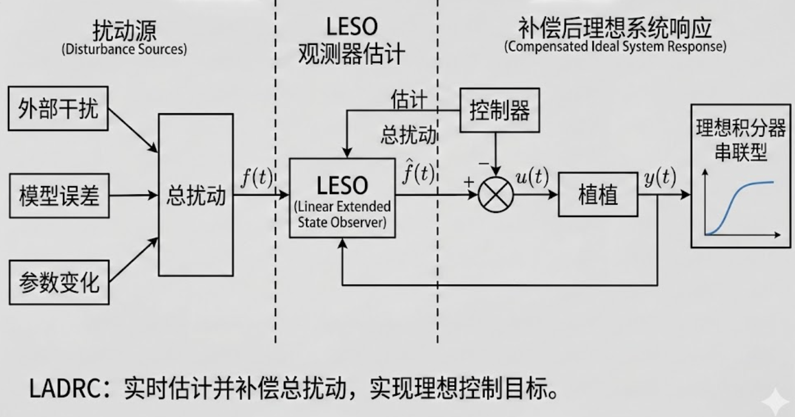

# LADRC快速上手

> 最近修改日期：2026-02-06
> 参与者：Jackrainman
> **配套代码**：[03-LADRC代码实战.md](./03-LADRC代码实战.md)

## 一、LADRC是什么

### 1.1 核心公式

LADRC（线性自抗扰控制）就记住这一个公式：

$$
u = (u₀ - ẑ₃) / b₀
$$

- `u₀`：PID算出来的控制量
- `ẑ₃`：观测器估计的总扰动
- `b₀`：系统控制效率系数

**人话**：PID只管追踪目标，LADRC额外做一件事——**实时估计干扰并把它干掉**。

### 1.2 核心思想（扰动估计+补偿）

LADRC的精髓就一句话：**把所有不确定性打包成"总扰动"，实时估计并补偿**。

```
PID的思路：看到偏差 → 调整输出
LADRC的思路：看到偏差 → 判断是目标变了还是扰动了 → 分别处理
```

- **内环（LESO）**：快速估计"总扰动"（包括外部干扰+模型误差）
- **外环（LSEF）**：像PID一样追踪目标

补偿后，复杂系统变成简单的**积分器串联型**，控制变得超简单。



而PID 的串联就可以简单理解为带追踪的积分器串联型，有时候会陷入“调参地狱”

物理对象的本质：积分器串联无论是一个机器人手臂还是一个无人机，它们的物理本质通常都是 **“双积分器”** 模型

- **输入（力/电流）** $\rightarrow$ 产生加速度 $\ddot{x}$

- **加速度积分一次** $\rightarrow$ 产生速度 $\dot{x}$

- **速度再积分一次** $\rightarrow$ 产生位置 $x$

这就是所谓的“积分器串联型”受控对象。韩京清教授认为：**控制的本质，就是把一个带有扰动的积分器串联型系统，变成一个理想的积分器串联型系统。**

---

## 二、LADRC vs PID

### 2.1 原理对比

| 对比项 | PID | LADRC |
|:------:|:---:|:-----:|
| **核心机制** | 看到误差再调整 | 主动估计并抵消扰动 |
| **模型依赖** | 不需要 | 几乎不需要（只需阶数） |
| **抗干扰** | 靠积分器慢慢压 | 观测器实时估计补偿 |
| **响应速度** | 快，但超调大 | 快，且超调小 |

### 2.2 结构对比
PID结构：


LADRC结构：


- **TD**：把跳变目标平滑化（防冲击）
- **LSEF**：类似PID，计算虚拟控制量
- **LESO**：观测器，估计状态和总扰动
- **扰动补偿**：把估计的扰动抵消掉

### 2.3 参数对比（⭐重点）

|    控制器    |     参数     | 物理意义             |
| :-------: | :--------: | :--------------- |
|  **PID**  | Kp, Ki, Kd | 比例/积分/微分增益       |
| **LADRC** | ωc, ωo, b₀ | 控制器带宽/观测器带宽/控制效率 |

**关键区别**：
- PID的3个参数耦合严重，调一个影响全局
- LADRC的3个参数物理意义清晰，**按顺序调能解决大部分问题**
注：这只是理论经验，目前暂没有实战经验
---

## 三、LADRC的优势

### 3.1 抗扰能力强

PID抗干扰主要靠**积分器**，但积分器有滞后，突变扰动时反应慢。

LADRC通过**LESO实时估计扰动**，在扰动影响输出前就补偿掉。

> **【图片占位符：图3-1 PID vs LADRC 抗扰动响应对比】**
>
> 描述：对比展示在相同突变扰动下，PID和LADRC的响应曲线差异。
>
> 建议：双曲线图，横轴为时间，纵轴为输出值。蓝色曲线（PID）显示扰动后缓慢恢复且有较大偏差；红色曲线（LADRC）显示扰动瞬间被快速补偿，几乎无偏差。标注"扰动注入时刻"和"LESO实时补偿"。

### 3.2 不依赖模型

PID不依赖模型，但性能受限；模型控制效果好（如MPC，LQR），但需要精确模型，且鲁棒性一般。

LADRC只需要知道**系统阶数**（输入到输出经过几次积分）：
- 电机位置控制 → 二阶（电压→速度→位置）
- 温度控制 → 一阶（功率→温度）
- 电流控制 → 一阶（电压→电流）

其他参数（惯性、摩擦等）通通打包成"总扰动"，LESO自动估计。

### 3.3 参数整定简单

LADRC把复杂参数整定变成**带宽设计**：

```
ωc = 控制器带宽（决定响应快慢）
ωo = 观测器带宽（决定估计快慢）
b₀ = 控制效率（从阶跃响应估算）
```

**控制器带宽**衡量的是：你希望系统跟踪目标（Setpoint）或者修正误差的速度有多快。
如果你在开车，$\omega_c$ 就是你打方向盘的果断程度。$\omega_c$ 越高，你过弯就越激进，车头指向目标的速度就越快。

**观测器带宽**衡量的是：观测器“感知”系统真实状态和“捕捉”外部扰动的速度。
还是假设你在开车， $\omega_o$ 就是你的眼睛和大脑处理路况信息的速度。即使你手打方向盘很快（$\omega_c$ 大），如果你的眼睛反应慢（$\omega_o$ 小），当你看到障碍物时，车可能已经撞上去了

经验公式：**ωo = (3~5) × ωc**，调好ωc再按比例调ωo即可。

**什么要这样设计？**

因为**感知必须领先于行动**：控制器（手）是根据观测器（眼）提供的信息来工作的。如果眼睛还没看清扰动到底有多大，手就开始乱动，系统必然震荡。并且，观测器在提取状态时不可避免会产生相位滞后。为了不影响控制环路的稳定性，观测器的滞后必须远小于控制环路的动态时间常数。


## 四、参数详解（TD + LADRC）

### 4.1 TD参数

跟踪微分器（TD）用于**平滑目标信号**和**提取微分**。

|   参数   |  名称  | 作用     | 怎么调                     |
| :----: | :--: | :----- | :---------------------- |
| **r**  | 速度因子 | 决定跟踪速度 | 目标跳变超调大 → 减小r；响应慢 → 增大r |
| **h₀** | 滤波因子 | 决定平滑程度 | 噪声大 → 增大h₀；相位滞后大 → 减小h₀ |
| **h**  | 积分步长 | 采样周期   | 就是控制周期，一般不动             |

**口诀**：
- `r`越大，跟踪越快，但可能超调
- `h₀`越大，滤波越强，但滞后越大

### 4.2 LADRC参数

#### b₀（扰动补偿系数）

**物理意义**：控制效率，单位控制量能产生多大加速度。

**怎么估**：
```
给被控对象一个阶跃输入U，测初始加速度a
b₀ = a / U
```

**调参**：
- 系统振荡 → b₀设大了，减小10%
- 响应迟缓 → b₀设小了，增大10%
- 不需要很准，±30%误差都能接受

##### 基于电机参数的精确计算方法

如果你有电机的详细参数，可以通过理论计算得到更准确的 b₀ 值。

**1. 确定物理参数**

首先，你需要明确手头有哪些电机参数。通常需要的参数包括：

- **J**：转动惯量（Moment of Inertia），单位 kg·m²
- **K_t**：转矩常数（Torque Constant），单位 N·m/A
- **R**：电枢电阻（Armature Resistance），单位 Ω（如果是电压控制）
- **B**：粘性摩擦系数（Viscous Friction Coefficient），通常很小可忽略，单位 N·m·s/rad

**2. 根据控制场景计算 b₀**

**场景 A：电流控制（或力矩控制）**

如果你的驱动器工作在力矩模式，即控制器输出 u 直接对应电流 i。

物理方程：根据牛顿第二定律 T = J·α（力矩 = 惯量 × 角加速度），以及电机力矩公式 T = K_t·i。

$$
J \ddot{\theta} = K_t \cdot i - T_{load} - B\dot{\theta}
$$

整理为最高阶导数形式（忽略扰动项，因为它们会被 ESO 观测并抵消）：

$$
\ddot{\theta} = \frac{K_t}{J} \cdot i - \dots
$$

**LADRC 模型形式**：ẏ = f + b₀·u

**计算公式**：对比系数可知：

$$
b_0 = \frac{K_t}{J}
$$

**场景 B：电压控制（PWM 占空比模式）**

如果你的驱动器工作在电压模式，即控制器输出 u 对应电机端电压 U。这时需要考虑电压方程。

物理方程：
- 电压平衡方程：U = iR + K_e·θ̇ （K_e 为反电动势常数，在国际单位制下数值通常等于 K_t）
- 力矩方程：J·θ̈ = K_t·i - B·θ̇

将 i = (U - K_e·θ̇)/R 代入力矩方程：

$$
J \ddot{\theta} = K_t \left( \frac{U - K_e \dot{\theta}}{R} \right) - B\dot{\theta}
$$

整理得到：

$$
\ddot{\theta} = -\left( \frac{K_t K_e}{J R} + \frac{B}{J} \right)\dot{\theta} + \frac{K_t}{J R} \cdot U
$$

**LADRC 模型形式**：在 LADRC 中，我们将与 θ̇ 相关的项视为总扰动的一部分，只关注控制量 U 前的系数。

**计算公式**：

$$
b_0 = \frac{K_t}{J \cdot R}
$$
注：该场景尚未验证，仅为理论推导

**3. 针对不同阶次的 LADRC**

b₀ 的物理意义随着控制器阶数的变化而略有不同：

**一阶 LADRC（通常用于速度环）**

如果你控制的是转速 ω（即 θ̇），系统方程降阶为一阶：

$$
\dot{\omega} = \dots + b_0 \cdot u
$$

此时 b₀ 的值与上述计算相同：
- 电流控制：b₀ = K_t/J
- 电压控制：b₀ = K_t/(J·R)

**二阶 LADRC（通常用于位置环）**

如果你控制的是位置 θ，系统是二阶的：

$$
\ddot{\theta} = \dots + b_0 \cdot u
$$

计算公式依然保持不变，因为 b₀ 始终是控制量 u 到最高阶导数（加速度）的传递增益。

**4. 无法获取准确参数时的估算技巧**

LADRC 对 b₀ 的精度要求并不极其严苛。b₀ 的偏差在 ±20% 甚至更大范围内，LADRC 通常仍能保持稳定，只是带宽和抗扰能力会受影响。

如果参数未知，可以使用频率响应法或阶跃响应法估测：

**阶跃响应法（近似）**：
1. 给电机施加一个小的阶跃输入 u_step（如 1V 或 1A）
2. 测量电机角加速度的最大值 α_max（即速度曲线在启动瞬间的斜率）
3. 计算：b₀ ≈ α_max / u_step

**调节原则**：
- **如果 b₀ 设得过大**：系统会认为控制能力很强，从而输出较小的控制量，导致系统响应变慢
- **如果 b₀ 设得过小**：系统会认为控制能力很弱，从而输出很大的控制量，可能导致系统震荡或超调

#### ωc（控制器带宽）

**物理意义**：闭环系统响应速度，类似PID的Kp但物理意义更清晰。

**初始值**：
```
期望调节时间T（如0.1s）→ ωc ≈ 10 / T = 100
```

**调参**：
- 响应慢 → 增大ωc（每次+20%）
- 超调/振荡 → 减小ωc（每次-20%）

#### ωo（观测器带宽）

**物理意义**：LESO估计扰动的速度，必须**快于**控制器才能及时补偿。

**经验公式**：
```
ωo = (3 ~ 5) × ωc
```

| 场景 | 推荐比例 | 说明 |
|:----:|:--------:|:-----|
| 噪声大 | 3× | 滤波效果好，估计略慢 |
| 通用 | 4× | 平衡性能，推荐 |
| 快速响应 | 5× | 估计快，但对噪声敏感 |

**调参**：
- 估计滞后明显（扰动后很久才补偿）→ 增大ωo
- 噪声敏感（输出抖动）→ 减小ωo

### 4.3 参数调节建议

**调节顺序**：
```
步骤1: 估计b₀（阶跃法）
步骤2: 设ωc为期望带宽的50%（保守起步）
步骤3: 设ωo = 4×ωc
步骤4: 测试响应，调ωc到满意
步骤5: 调ωo优化抗扰性能
步骤6: 微调b₀消除振荡或迟缓
```

---

### 五、参数调节原则

**四句话**：
```
响应慢 → 增ωc
有振荡 → 减ωc或减b₀
估计慢 → 增ωo
噪声大 → 减ωo
```

**调试技巧**：
1. 先调ωc让响应速度满意
2. 再调ωo优化抗扰性能
3. 最后微调b₀消除初始状态的振荡
4. TD参数（r、h₀）用来优化目标跟踪的平滑性

**避坑提醒**：
- ωo不要超过10×ωc（会噪声爆炸）
- b₀不准没关系，LESO在跑起来之后会补偿，但是要小心上电瞬间的大幅震荡

---

## 代码参考

完整代码实现、调试技巧、常见问题排查，详见：

**→ [03-LADRC代码实战.md](./03-LADRC代码实战.md)**

---

> 💡 **最后提醒**：LADRC不是万能的，但它把工程中最头疼的"不确定性"和"干扰"问题用统一框架解决了。先跑通代码，再理解原理，最后根据实际系统调参，你会发现它比PID更"省心"。
