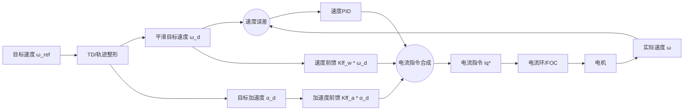
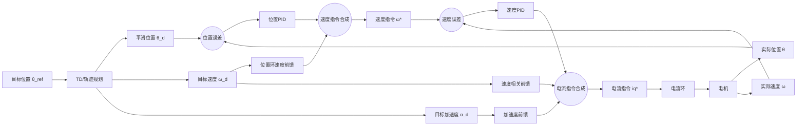

# PID、前馈、TD 关系梳理

这篇只解决一件事：把 **目标怎么给、控制怎么跟、前馈补什么、模型不准谁兜底** 这几层拆开。

如果你总觉得 “TD、前馈、PID、LADRC 好像都在干一件事”，那通常不是算法本身难，而是层次混了。

图 1：速度环里，TD/轨迹整形给出更合理的 $\omega_d,\alpha_d$，反馈和前馈共同合成最终驱动量。

图 2：位置-速度串级里，TD/轨迹规划负责把生硬目标变成可执行参考，前馈补已知需求，PID 负责修正剩余误差。

## 1. 先给总框架

一个位置控制系统，通常可以拆成 4 层：

| 层次 | 你在回答什么问题 | 常见做法 |
|---|---|---|
| 目标层 | 你到底让系统怎么走 | 位置阶跃、梯形速度、S 曲线、TD 后的平滑目标 |
| 反馈控制层 | 偏了以后怎么纠正 | 串级 PID、PI + P、LADRC、状态反馈 |
| 补偿层 | 能不能别等偏了再补 | 速度前馈、加速度前馈、重力补偿、摩擦补偿、惯量前馈 |
| 观测/估计层 | 模型不准时谁来兜底 | ESO、DOB、LADRC 的总扰动估计 |

一句话记住：

- 目标层决定“你让系统怎么走”。
- 反馈层决定“偏了以后怎么拉回来”。
- 补偿层决定“已知会发生什么，先补一部分”。
- 观测层决定“没建准的东西，谁来估出来”。

你现在最容易混的，通常就是把这四层当成同一层了。

## 2. 建模到底在这套体系里管什么

这里要先纠正一个很常见的误解：

“这本质上是建模问题” 这句话不算错，但如果只说到这里，还是太悬。

更准确的说法是：

> 这不是单纯一句“这是建模问题”就完了，而是一个“建模 + 鲁棒控制 + 轨迹设计”的综合问题。

运动控制里通常同时有这几件事：

- 目标怎么给：阶跃、TD、梯形、S 曲线
- 对象本身长什么样：惯量、摩擦、重力、延迟、饱和
- 控制器怎么设计：PID、前馈、LADRC
- 模型有多准：准一点就多做前馈，不准就多靠观测器和鲁棒性

所以更落地的说法是：

> 你需要一个“够用的控制对象模型”，然后决定哪些靠模型补偿，哪些靠反馈和观测器兜底。

### 2.1 先把“建模”降到地上

很多人一听建模，就以为要先搞一整套很复杂的动力学推导。

其实工程上更常见的目标不是：

- 追求“真实世界完整模型”

而是：

- 追求“控制上够用的模型”

也就是你只先建那些最影响控制效果的部分。

建模不是为了“证明自己会公式”，而是为了回答这些控制问题：

1. 为什么它冲不过去？
2. 为什么它快到时刹不住？
3. 为什么低速抖？
4. 为什么换个姿态表现就不一样？
5. 为什么前馈有时候很好，有时候反而发疯？

### 2.2 对单轴位置-速度控制，最小模型是什么

如果先不管复杂因素，最核心通常就是三条关系。

**1. 位置和速度关系**

$$
\dot{\theta} = \omega
$$

这表示位置是速度的积分，所以外环位置控制本质上是在管“速度该怎么变化”。

**2. 速度和力矩关系**

$$
J\dot{\omega} = \tau - B\omega - \tau_f - \tau_{load}
$$

这里：

- $J$：转动惯量
- $\tau$：电机输出力矩
- $B\omega$：粘性阻尼
- $\tau_f$：摩擦项
- $\tau_{load}$：外部负载扰动

这条式子很重要，因为它直接告诉你：

- 为什么重、惯量大就难调
- 为什么同样的力矩，惯量大时加速度更小
- 为什么起步慢，刹车也慢
- 为什么更容易“冲不过去”或“刹不住”

**3. 电机力矩和电流关系**

如果电流环已经做好，通常可以近似认为：

$$
\tau = K_t i
$$

也就是电流基本直接决定力矩。

如果你没有明确电流环，而是直接给电压，那还要加电气模型：

$$
L\dot{i} + Ri + K_e\omega = u
$$

但很多工程上，做位置环、速度环设计时，会先把内层等效掉，只保留最主要的机械侧关系。

### 2.3 最实用的第一层模型长什么样

对速度环，如果内层够快，常常可以先近似成：

$$
G_{\omega}(s) = \frac{K}{Ts + 1}
$$

也就是一个一阶惯性环节。

这个模型已经足够解释很多现象：

- 为什么太激进会抖
- 为什么大惯量会变慢
- 为什么前馈能帮忙

对位置环，如果速度环已经闭好，可以把“位置环往里看”的对象近似成：

$$
G_{\theta}(s) = \frac{K_{\omega}}{Ts + 1} \cdot \frac{1}{s}
$$

也就是：

- 速度环像一个一阶系统
- 再接一个积分，变成位置

这已经是很多串级控制分析的标准起点了。

### 2.4 简单模型解释不了时，先往哪里加

当你发现简单模型解释不了现象，就逐步加项，而不是一上来推满天公式。

工程上最优先考虑的通常是：

- 摩擦：解释低速爬行、小误差不动、反向切换别扭
- 重力：解释机械臂不同角度手感不一样
- 惯量变化：解释不同姿态、不同负载表现不同
- 间隙、弹性、共振：解释快速刹车后还会弹一下、某个频率特别容易振
- 饱和和死区：解释小命令不动、大命令一上来顶满

### 2.5 怎么建模最实用

你现在最适合的不是纯理论大推导，也不是纯黑箱乱拟合。

最推荐的是：

> **灰箱建模：先写出基本物理结构，再通过实验把参数估出来。**

比如：

- 给固定驱动，记录速度响应，拟合出一阶增益 $K$ 和时间常数 $T$
- 给已知电流 / 力矩，看加速度多大，估惯量 $J$
- 低速慢扫，正反方向分别测，估摩擦
- 不同角度缓慢停住，记录维持静止的输出，估重力项

这比一上来追求完整动力学大模型更有效。

### 2.6 建模和 PID、LADRC、LQR 到底是什么关系

这里也很容易走到二分法里去。

#### PID 不是“不要模型”

只是它对模型依赖最弱。

你哪怕没有明确写出传递函数，实际上也默认知道一些东西：

- 这是个惯性对象，不会瞬间到位
- 增益太大可能振
- 惯量大时要更保守
- 有摩擦、饱和、死区

这些其实已经是“朴素模型”了。

所以更准确地说：

> PID 不是没有模型，而是可以只靠经验模型和实验感觉工作。

#### LADRC 也不是“不要模型”

LADRC 更准确的说法是：

> 只需要一个比较粗的名义模型，剩下的不确定性和扰动交给 ESO 去估。

比如单轴时常常会先假设：

$$
\ddot{y} = b_0 u + f
$$

这里：

- $b_0$ 是粗略控制增益
- $f$ 把你所有没建准的东西都打包成“总扰动”

这说明 LADRC 也不是凭空工作的，它通常至少需要：

- 系统阶次大概知道
- 控制输入对输出影响方向知道
- 名义增益 $b_0$ 有个大概量级

只是它不像传统模型控制那样要求每一项都准。

#### LQR 也不是“必须完美精确模型”

更准确地说：

> LQR 更偏模型驱动，模型越合理越能发挥优势。

它依赖的是状态空间模型：

$$
\dot{x} = Ax + Bu
$$

如果模型离实际太远，效果当然会变差。

但很多时候：

- 线性化模型
- 工作点附近模型
- 简化模型

就已经能设计出不错的 LQR。

所以不要把它理解成：

- PID / LADRC = 无模型
- LQR = 精确模型

这会过于二分。

### 2.7 一句最落地的话

你现在要做的，不是“建立完美模型”，而是：

> **先建立一个能解释主要现象的最小模型，再决定哪些靠前馈，哪些靠反馈，哪些靠观测器。**

更工程一点的总结就是：

- 模型越差，越要靠反馈、鲁棒性、观测器、保守设计
- 模型越好，越能多用前馈、补偿、状态反馈、更高性能方法

但真实工程里往往不是二选一，而是：

> **粗模型 + 反馈 + 补偿 + 观测，一起上。**

## 3. 前馈到底是什么

前馈不是“提前看误差”，而是：

> 根据目标轨迹或可测扰动，提前给执行器一部分它本来就需要的量。

如果最终控制量是电流，那么前馈最后通常会落成 **电流前馈**。最典型的形式是：

$$
i_q^* = u_{PID} + K_{ff,\omega}\omega_d + K_{ff,\alpha}\alpha_d
$$

这里的关键不是“前馈这个名字”，而是你到底补的是什么。

### 3.1 速度前馈

你已经知道目标速度是 $\omega_d$，那就先给一部分与速度相关的驱动量。

它主要解决：

- 跟踪滞后
- 速度误差大
- 积分项压力过大

直觉上就是：

“我已经知道要跑这么快，那先打一部分维持这速度所需的力。”

### 3.2 加速度前馈

你已经知道目标速度马上要变化，那就提前给一部分克服惯量的驱动量。

它主要解决：

- 加速时总慢半拍
- 轨迹拐点跟不上
- 响应看起来不够利落

它最依赖三件事：

- 惯量模型是否大致靠谱
- 目标加速度是否平滑
- 执行器是否真有余量输出这股力

### 3.3 重力补偿

这是机械臂里最典型、也最实用的一种前馈。

直觉很简单：

“我知道这个姿态下重力会把杆往下拽，那我先给一个抵消重力的力矩。”

它的价值是把反馈控制从“长期对抗重力”里解放出来。

### 3.4 摩擦补偿

低速、反向、起动时，摩擦往往特别烦。

这时候你提前补一部分克服摩擦的量，系统通常会更容易动起来，也更不容易在小误差附近磨蹭。

### 3.5 惯量 / 动力学前馈

再往上走，就是根据目标轨迹和对象模型，直接算“这条轨迹理论上需要多少力矩”。

机械臂里很常见，本质上就是更完整的模型补偿。

## 4. 为什么“位置阶跃 + 导数类前馈”会危险

这里最容易出误解。

“直接位置阶跃 + 前馈 = 电机一定飞起来” 这句话不完全对。  
更准确的说法是：

> **直接位置阶跃 + 速度/加速度这类导数相关前馈，往往很危险。**

原因是位置阶跃本身的导数非常极端：

- 位置一步跳变
- 理论速度瞬间无穷大
- 理论加速度更离谱

所以：

**位置阶跃不能直接拿去做速度前馈或加速度前馈。**

否则你相当于在数学上给系统一个尖峰命令，工程上就会表现成：

- 爆冲
- 电流猛顶
- 内环瞬时饱和
- 还没稳住就开始反向刹车

这也是为什么很多人会觉得“一上前馈就飞”。

问题往往不是前馈这个思想错了，而是前馈吃到的参考不对。

## 5. TD 和前馈到底是什么关系

不是“必须 TD + 前馈”，而是：

> **凡是和导数有关的前馈，几乎都更适合配合 TD / 轨迹整形一起用。**

因为你需要的是：

- 有限的速度参考
- 合理的加速度参考
- 连续、可执行的命令

TD、梯形速度轨迹、S 曲线，本质上都在干一件事：

**把原始目标变成执行器吃得下的参考。**

但也要注意，**不是所有前馈都依赖 TD**。

下面这些即使没有 TD，一样很有价值：

- 重力补偿
- 摩擦补偿
- 某些稳态速度补偿

所以更准确的理解是：

- 导数类前馈，通常依赖平滑参考；
- 静态补偿类前馈，不一定依赖 TD。

## 6. 为什么别人“前馈且稳”

如果你看到别人用了前馈还很稳，很多时候不是因为他“硬对位置阶跃求导然后直接怼”，而是下面几种情况之一：

### 6.1 前面已经有轨迹规划 / TD

你表面上看到的是“目标位置变了”，但控制器真正吃到的是：

- 平滑位置参考
- 平滑速度参考
- 平滑加速度参考

这时导数类前馈当然可以稳定工作。

### 6.2 他加的是重力补偿 / 摩擦补偿

这类前馈不是“把系统打飞”，而是：

- 先替系统扛住一部分负载
- 反馈只负责修剩余误差

它通常会让系统更稳，而不是更猛。

### 6.3 前馈做了限幅、滤波、软启动

即使是速度前馈、加速度前馈，也常常会加上：

- 限幅
- 低通
- 平滑
- 软启动

所以不会一下子把命令打满。

### 6.4 内环带宽够高，模型也比较准

当电流环、速度环够快，对象模型又比较接近真实时，前馈更像“恰到好处地帮一把”，而不是“过度发力”。

### 6.5 对象比较干净

如果惯量、摩擦、负载变化都在可控范围内，前馈就更容易发挥效果。

## 7. 三大流派怎么理解

### 7.1 纯反馈派

做法：

- 直接给位置目标
- 主要靠 PID 或串级 PID 自己消化

优点：

- 简单
- 上手快
- 调试门槛低

缺点：

- 很难同时做到又快又顺
- 负载一变，表现容易变
- 更依赖参数折中

适合：

- 入门
- 简单机构
- 小惯量系统
- 先把系统跑通

### 7.2 轨迹 + 反馈 + 前馈派

做法：

- 前端先做 TD / 梯形速度 / S 曲线
- 中间做反馈控制
- 再加前馈补偿

这其实是很多成熟运动控制系统的主线。

优点：

- 又快又顺
- 更符合机械系统本性
- 对机械更友好

缺点：

- 结构更复杂
- 轨迹参数、反馈参数、前馈参数要分层调

适合：

- 机械臂
- 伺服
- 较高性能定位系统
- 对观感和机械冲击有要求的系统

### 7.3 观测 / 抗扰派

做法：

- 在反馈控制里加入 ESO / DOB / LADRC
- 让系统自动估计扰动和模型误差

优点：

- 负载变化大时更鲁棒
- 不必把每项模型都建得特别准

缺点：

- 参数逻辑和 PID 不同
- 观测器太快会放大噪声
- 对采样周期和离散实现更敏感

适合：

- 负载变化大
- 模型不确定
- 摩擦和外扰明显
- 机械系统不太“干净”

## 8. 重、惯量大，是不是就一定要 LADRC

不一定。

更准确地说，重、惯量大意味着你更需要处理：

- 加速困难
- 刹车困难
- 过冲风险
- 参数变化
- 外界扰动

这时通常有两条路。

### 8.1 模型比较清楚

如果：

- 惯量大致知道
- 重力项能算
- 机械结构比较固定
- 刚性还不错

那么很多时候：

> **轨迹规划 + 前馈 + PID**

就已经很强了。

这类系统不一定非要 LADRC。

### 8.2 模型不太准，负载变化又大

如果：

- 负载老在变
- 摩擦复杂
- 惯量变化明显
- 建模成本高

那么：

> **LADRC / DOB / 扰动观测**

就会更有吸引力。

因为你不需要把每一项都算得很准，而是让观测器去兜住那些“没算准的东西”。

## 9. “远处顶满，近处减速，最后贴近” 是什么

这个思路很常见，也很好用。

但它更像：

- 外环非线性策略
- 目标生成策略
- 近似时间最优的工程写法

而不是 LADRC 独有的本质。

它通常可以概括成：

- 误差很大：输出顶满，先赶紧跑
- 误差变小：按规则降输出，开始收
- 靠近目标：用小速度、小力慢慢贴近

这类思路可以和很多内环结合：

- PID
- PD
- 串级 PI / PID
- LADRC
- 其他状态反馈

所以它和 LADRC 的关系更准确地说是：

> 它可以和 LADRC 结合，但它不是 LADRC 独有。

## 10. 把几种思路摆在一起

| 思路 | 目标怎么给 | 控制怎么做 | 优点 | 风险 / 难点 |
|---|---|---|---|---|
| 直接阶跃 + PID | 生阶跃 | 纯反馈 | 简单 | 很难又快又顺 |
| TD / 轨迹 + PID | 平滑目标 | 纯反馈 | 顺、好调 | 结构更复杂 |
| TD / 轨迹 + PID + 前馈 | 平滑目标 | 反馈 + 补偿 | 又快又顺 | 模型和参数分层更复杂 |
| 直接阶跃 + 重力 / 摩擦补偿 + PID | 生阶跃 | 反馈 + 静态补偿 | 很实用 | 解决不了所有动态问题 |
| TD / 轨迹 + 前馈 + LADRC | 平滑目标 | 抗扰 + 补偿 | 鲁棒性更强 | 观测器参数更难 |
| 顶满-减速-贴近 + 任意内环 | 分段 / 非线性目标 | 内环跟踪 | 手感好、直觉强 | 规则切换要顺 |

## 11. 一版更准确的结论

把前面的讨论压成几句，基本就是：

- 直接位置阶跃 + 纯导数类前馈，容易过猛，所以通常要配合轨迹整形 / TD。
- 重力补偿、摩擦补偿这类前馈，不一定需要 TD，也能显著提升稳定性。
- 重、惯量大，不代表一定要 LADRC，但意味着简单 PID 更容易吃力。
- 如果模型较准，轨迹规划 + 前馈 + PID 很强。
- 如果模型不准、负载变化大，LADRC / DOB 更有优势。
- “远处顶满、近处减速、最后贴近” 是一种很实用的外环 / 轨迹思想，不是 LADRC 独有，但可以和 LADRC 结合。

## 12. 实际升级顺序

如果你现在还在建立直觉，不建议一口气把所有东西全上。

更稳的顺序通常是：

1. 先把串级位置-速度环调通，建立最基本的误差直觉。
2. 在位置目标前加一个简单的梯形速度或 S 曲线，先别急着上完整 TD。
3. 再加最有价值的前馈。机械臂场景通常优先考虑重力补偿，再看速度 / 加速度前馈。
4. 如果发现模型总不准、负载总在变，再认真考虑 LADRC / ESO / DOB。

这个顺序的核心不是“保守”，而是：

**每加一层，都要知道自己到底在解决哪一类问题。**

这类问题不能只按名字类比，最好回到具体实现里看控制律和状态量分别在什么位置起作用。相关内容可以继续对照 [06-LADRC算法详解.md](./06-LADRC算法详解.md) 和 [07-LADRC代码实战.md](./07-LADRC代码实战.md) 一起看。
