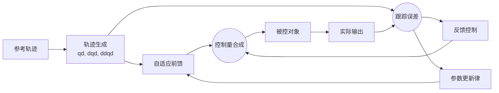

# 自适应前馈

> 最近修改日期：2026-03-30
> 参与者：OpenCode
> 本文档是 `ControlTheory` 的专题补充，暂不插入主线。
> 前置阅读：[PID，前馈，TD.md](./PID，前馈，TD.md)

## 一、先把概念说清

前馈本来就在做一件事：**在误差还没有明显长出来之前，先按已知规律补一部分控制量**。

固定前馈的问题也很直接：它通常依赖一个写死的模型或写死的增益。

- 负载变了，原来的前馈可能补少了
- 摩擦变了，原来的前馈可能补多了
- 工况跨度大时，同一组前馈参数往往顾不过来

所谓**自适应前馈**，不是把反馈扔掉，而是让前馈本身的参数可以在线调整。它的核心目标是：

1. 让前馈继续负责“提前补偿”
2. 让反馈只去修正剩余误差
3. 在模型不完全准、工况会变化时，保持前馈仍然有用

一句话概括：

> **固定前馈**是“我先按已知模型补”；**自适应前馈**是“我一边补，一边根据误差继续修正自己”。

## 二、它和 TD、反馈、ESO 不是同一层

这类概念最容易混。

| 层次 | 主要任务 | 典型输出 |
|---|---|---|
| 参考生成层 | 把生硬目标变成可执行参考 | $q_d, \dot{q}_d, \ddot{q}_d$ |
| 前馈层 | 根据已知需求提前补偿 | $u_{ff}$ |
| 反馈层 | 根据误差把系统拉回去 | $u_{fb}$ |
| 观测层 | 估计未知扰动和未建模项 | 扰动估计量 |

所以：

- **TD / 轨迹规划**负责把目标变平滑
- **前馈**负责按已知需求先补一点
- **反馈**负责兜底和纠偏
- **ESO / DOB**负责把未知项估出来

自适应前馈只是把“前馈这一层”做成了可在线更新的结构，它并不等价于 PID、LADRC、ESO 或 TD。

很多工程里，最稳妥的结构其实是：

$$
u = u_{fb} + u_{ff}
$$

其中反馈保稳定，自适应前馈负责减轻反馈负担。

## 三、为什么固定前馈经常不够用

网络资料里对前馈有一个共同强调：**前馈有效的前提，是你对对象和扰动关系有足够准的描述**。这也是固定前馈最容易失效的地方。

典型失效原因有这些：

### 3.1 参数会漂

- 负载变化导致等效惯量变化
- 温升导致摩擦、阻尼、电机常数变化
- 姿态变化导致重力项变化

### 3.2 扰动虽然有规律，但规律本身会变

例如周期扰动的：

- 幅值会变
- 相位会漂
- 主频附近会轻微偏移

这时，写死的“一个正弦补偿项”通常只能在某个工况点好用。

### 3.3 仅靠反馈会慢半拍

反馈控制天然是“先看到偏差，再补回来”。

如果已知需求本来就能提前估到，那么完全依赖反馈，往往会带来：

- 跟踪滞后
- 峰值误差偏大
- 反馈增益被迫调高
- 噪声和抖动更容易被放大

所以自适应前馈的价值，并不是替代反馈，而是把“本来就可以预先补掉的一部分”尽量提前做掉。

## 四、一个最常见的统一写法

很多自适应前馈方案，最后都可以写成“**基函数 + 在线参数**”的形式：

$$
u_{ff}(t) = \theta^T(t)\,\phi(t)
$$

其中：

- $\phi(t)$：你事先选好的已知基函数
- $\theta(t)$：在线更新的参数

然后再根据误差去更新参数，例如离散形式常写成：

$$
\theta_{k+1} = \theta_k - \Gamma \phi_k e_k
$$

这里不用把这个式子理解得太神秘，它本质上就是：

> 如果当前这组前馈基函数和误差有关，那就顺着减少误差的方向，把前馈参数往前推一点。

这个统一写法的好处是，很多看起来完全不同的方案，其实只是 **$\phi$ 选得不一样**：

- 如果 $\phi = [\ddot{q}_d, \dot{q}_d, g(q_d)]^T$，那更像**参数自适应前馈**
- 如果 $\phi = [\sin \omega t, \cos \omega t]^T$，那更像**周期扰动自适应前馈消除**
- 如果 $\phi$ 是一段参考传感器信号的延时向量，那更像**自适应滤波 / FxLMS**

## 五、常见的两条路线

### 5.1 参数自适应前馈

这条路线常见于运动控制和机械系统控制。

思路是：先把前馈写成你认为“最影响控制效果”的那几项，然后在线调整这些项前面的参数。

例如单轴伺服系统，常见的工程写法可以理解成：

$$
u = u_{fb} + \hat{J}\ddot{q}_d + \hat{B}\dot{q}_d + \hat{\tau}_g + \hat{\tau}_f
$$

其中：

- $\hat{J}$：在线修正后的等效惯量
- $\hat{B}$：在线修正后的阻尼或粘性项
- $\hat{\tau}_g$：重力补偿项
- $\hat{\tau}_f$：摩擦补偿项

它适合的场景通常是：

- 参考轨迹已知
- 系统主要误差来源能被少数物理项解释
- 负载、姿态、摩擦等参数会变化，但变化不是完全无规律

这类方法的优点是物理意义强，和传统运动控制体系衔接自然。

它的难点也很明确：

- 你还是得先选对“该自适应哪些项”
- 如果参数化结构本身就选错了，自适应也救不了太多
- 激励不够时，参数可能学不准

### 5.2 自适应前馈消除（AFC）

另一条非常常见的路线，是针对**周期性扰动**做在线补偿。

这类方法在公开资料里经常叫：

- Adaptive Feedforward Cancellation（AFC）
- Adaptive Feedforward Compensation
- Narrowband / Harmonic Disturbance Rejection

它最典型的对象不是“惯量有点偏”，而是：

- 电机转矩脉动
- 旋转机械的谐波扰动
- 重复运动里的周期误差
- 振动和噪声控制中的窄带扰动

它的基本想法是：

1. 假设扰动在某个频率附近有明显主成分
2. 前馈直接生成同频的补偿信号
3. 在线调整这个补偿信号的幅值和相位
4. 让误差里的该频率成分尽量被抵消

一个非常经典的写法是：

$$
u_{ff}(t) = a(t)\sin(\omega t) + b(t)\cos(\omega t)
$$

这里在线更新的是 $a(t), b(t)$，也就是补偿信号的幅值和相位信息。

这类方法特别适合：

- 扰动频率已知或可估
- 误差具有明显重复性
- 你希望在不大改原反馈器的前提下，专门压某几条谐波

MIT 的 AFC 相关论文和近年的工业应用资料都说明了一点：**它对重复轨迹、周期误差和谐波抑制尤其有效**。

## 六、如果有参考传感器，还会走到 FxLMS

当你不仅知道“扰动大概是什么频率”，还可以测到一个**和扰动相关的参考信号**时，常见做法会进一步走向自适应滤波。

最典型的例子是主动噪声控制和主动振动控制。

这时常见结构是：

- 一个参考传感器先测到噪声或扰动的相关信号
- 一个自适应滤波器把参考信号变成补偿信号
- 误差传感器测剩余误差
- 在线算法根据误差更新滤波器系数

工程里最常见的名字就是 **Filtered-X LMS（FxLMS）**。

它和普通 LMS 最大的差别在于：

> 控制器输出到误差传感器之间还有一条“次级通道”，这条通道的动态必须被考虑进去。

所以 FxLMS 一般要先有一个对次级通道的估计。MathWorks 的公开示例也特别强调了这一点：**如果不考虑次级通道，适应方向可能会错**。

对战队成员来说，可以先把它理解成：

- 普通自适应前馈：直接学“该补多少”
- FxLMS：还要额外学清楚“补偿量经过执行器和传感器路径后，会变成什么样”

## 七、它和 LADRC / ESO 的关系

这两个方向可以互补，但不要混成一回事。

| 方案 | 主要在处理什么 | 更像哪一层 |
|---|---|---|
| 固定前馈 | 已知参考需求、已知模型项 | 补偿层 |
| 自适应前馈 | 已知结构但参数会变 | 补偿层 |
| ESO / LADRC | 未知扰动、未建模动态 | 观测与补偿层 |

可以这样理解：

- **自适应前馈**更像“我知道该补哪些形状，只是系数还要边跑边调”
- **ESO / LADRC**更像“我不要求你先把扰动分门别类建出来，先统统估了再补”

所以两者完全可以并存：

- 前馈负责补掉已知结构里的大头
- ESO / LADRC 负责兜底那些没有提前建好的剩余扰动

## 八、工程上最容易踩的坑

### 8.1 反馈环没稳，就先上自适应

这是最常见的错误。

如果基础反馈环本来就不稳，或者带宽、采样、饱和问题都没理顺，自适应前馈通常只会把问题放大。

顺序应该是：

1. 先把基本反馈环闭稳
2. 再验证固定前馈是否真的有收益
3. 最后再把“会漂的那部分”改成在线更新

### 8.2 一上来就学太多参数

工程上更推荐：

- 先学 1 到 3 个最关键参数
- 先压 1 条主要谐波
- 先证明收益，再扩展维度

参数一多，调参、激励、稳定性分析都会明显变难。

### 8.3 忽略执行器饱和和更新限幅

自适应律如果没有限幅、投影、冻结条件，很容易把前馈参数推飞。

至少应考虑：

- 参数上下界
- 更新速率限制
- 大误差或饱和时暂停更新
- 参考信号缺失时冻结学习

### 8.4 指望它解决完全随机的扰动

自适应前馈最擅长的是：

- 已知结构的变化
- 可测参考驱动的扰动
- 有明显重复性的周期误差

如果扰动完全随机、频谱很宽、而且没有相关参考信号，那么仅靠自适应前馈通常不会特别理想，这时往往更依赖鲁棒反馈、观测器或滤波。

## 九、战队场景里什么时候值得考虑

如果满足下面任意一类条件，就值得把它当成候选工具：

### 9.1 轨迹是已知的，但负载会变

例如：

- 云台不同挂载下的加减速
- 机械臂不同姿态和抓取负载下的跟踪
- 单轴伺服在轻载、重载之间切换

这时可以优先考虑参数自适应前馈。

### 9.2 误差带有明显周期性

例如：

- 电机换相或结构偏心带来的周期纹波
- 重复扫描、重复旋转中的固定频率误差
- 振动台或高速机构中的谐波扰动

这时更接近 AFC 的适用范围。

### 9.3 已经有可用的扰动参考传感器

例如：

- 麦克风、加速度计、编码器派生参考信号
- 可以提前测到的电压纹波、转速脉动、结构振动参考量

这时可以进一步考虑 FxLMS 这一类自适应滤波前馈方案。

## 十、先记住这几句话

1. 自适应前馈不是为了替代反馈，而是为了让反馈少干一点“本可提前补”的活。
2. 它最适合处理“结构已知但系数会变”的问题。
3. 对周期扰动，AFC 往往比单纯拉高反馈增益更有针对性。
4. 有参考传感器时，FxLMS 是非常典型的一条工程路线。
5. 没有稳定反馈闭环和边界保护时，不要贸然上自适应。

## 参考资料

以下资料用于整理本文思路，正文内容为归纳转述，不是逐句翻译。

- Wikipedia: [Feed forward (control)](https://en.wikipedia.org/wiki/Feed_forward_(control))
- Wikipedia: [Adaptive filter](https://en.wikipedia.org/wiki/Adaptive_filter)
- MathWorks: [Active Noise Control Using a Filtered-X LMS FIR Adaptive Filter](https://www.mathworks.com/help/audio/ug/active-noise-control-using-a-filtered-x-lms-fir-adaptive-filter.html)
- MathWorks: [Signal Enhancement Using LMS and NLMS Algorithms](https://www.mathworks.com/help/dsp/ug/enhance-a-signal-using-lms-and-normalized-lms-algorithms.html)
- Henrik Mosskull, Bo Wahlberg, [Adaptive feedforward control of sinusoidal disturbances with applications to electric propulsion systems](https://doi.org/10.1016/j.conengprac.2024.105892), Control Engineering Practice, 2024
- Joseph Harry Cattell, [Adaptive feedforward cancellation viewed from an oscillator amplitude control perspective](http://hdl.handle.net/1721.1/28280), MIT, 2003
- Qiong Liu et al., [Adaptive Feedforward Neural Network Control with an Optimized Hidden Node Distribution](https://arxiv.org/abs/2005.11501)
