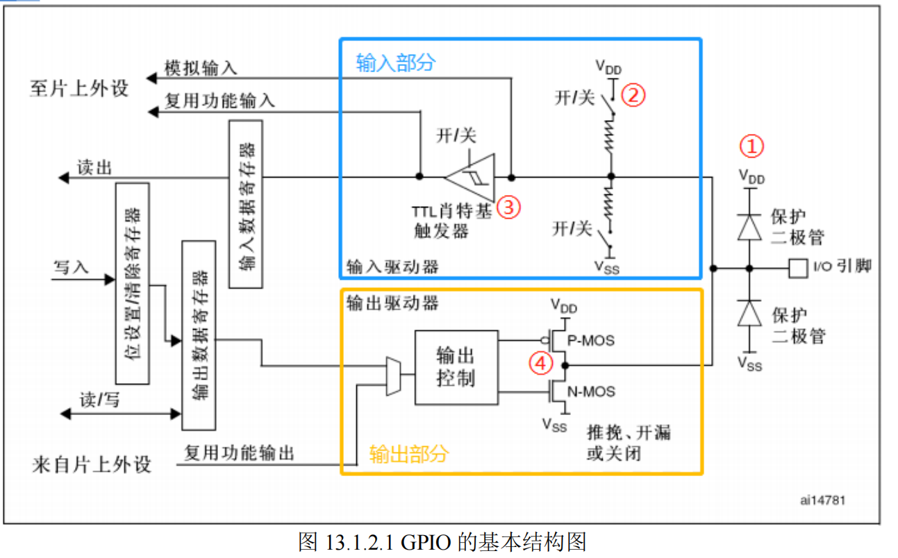
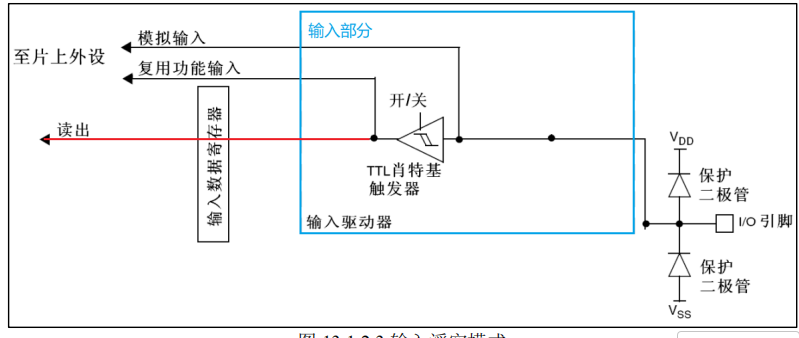
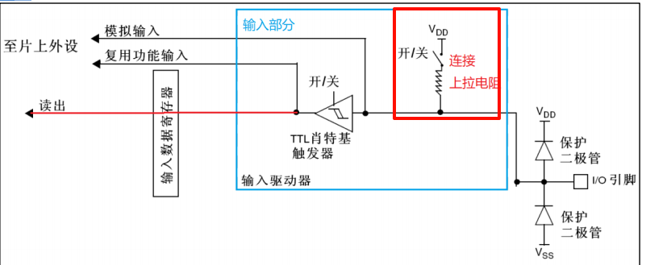
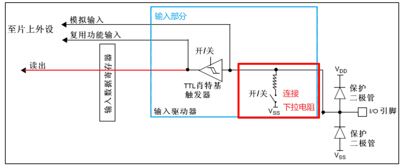
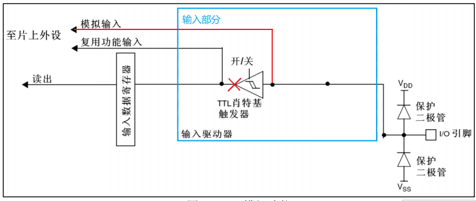
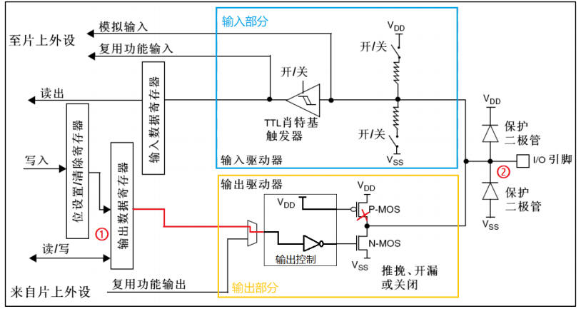
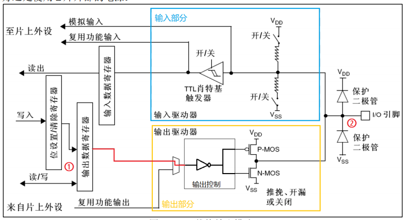
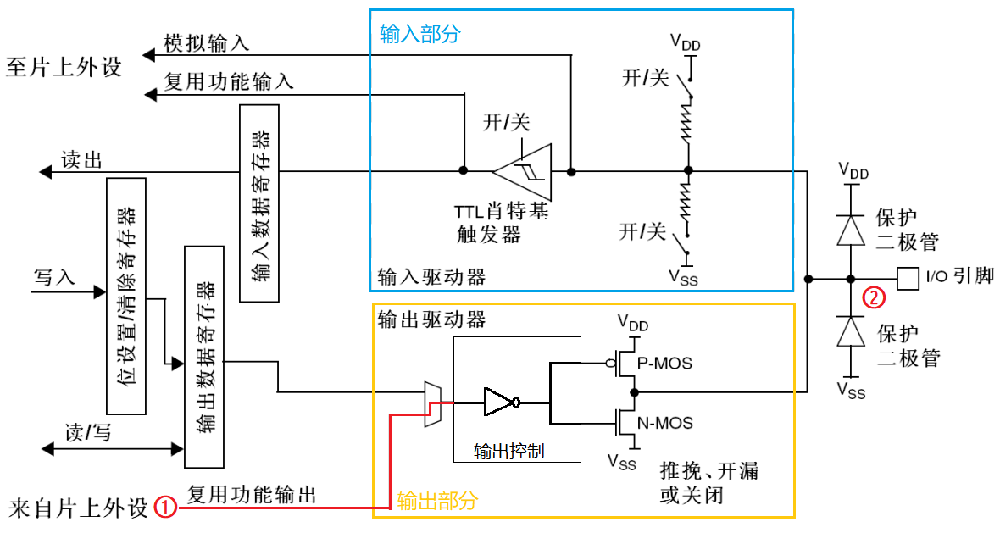
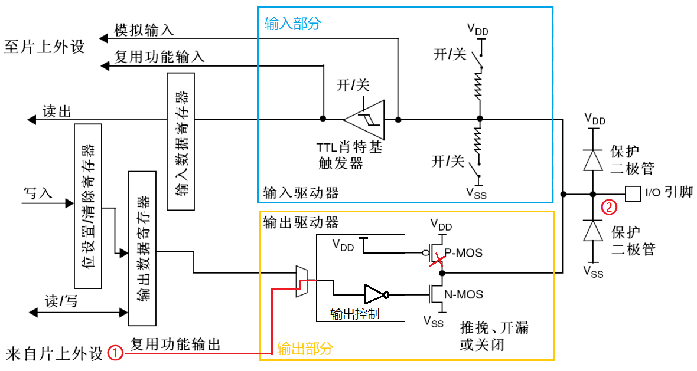

## GPIO 有八种模式

### 1. 四种输入模式

- **输入浮空 (Input Floating)**： 引脚电平完全由外部电路决定。在不接外设时，电平是不确定的（处于浮动状态）。

- **输入上拉 (Input Pull-up)**： 引脚内部连接一个上拉电阻到 VDD​。在默认状态下，引脚维持高电平。

- **输入下拉 (Input Pull-down)**： 引脚内部连接一个下拉电阻到 VSS​。在默认状态下，引脚维持低电平。

- **模拟输入 (Analog Mode)**：：上下拉电阻断开，施密特触发器关闭，双 MOS 管也关闭。其他外设可以通过模拟通道输入输出。该模式下需要用到芯片内部的模拟电路单元单元，用于 ADC、DAC、MCO 这类操作模拟信号的外设。

### 2. 四种输出模式

- **开漏输出 (Output Open-drain)**： 引脚只能输出低电平（接 GND）或高阻态。若要输出高电平，必须外部接上拉电阻。常用于 I2C 通信。

- **推挽输出 (Output Push-pull)**： 引脚既能输出高电平，也能输出低电平。驱动能力强，是最常用的输出模式。

- **复用推挽 (Alternate Function Push-pull)**： 引脚不由 GPIO 控制器直接控制，而是由片上外设（如 SPI 的 MOSI、PWM 输出）控制。

- **复用开漏 (Alternate Function Open-drain)**： 同样由片上外设控制，但输出特性为开漏（如 I2C 的 SCL/SDA 线）。
