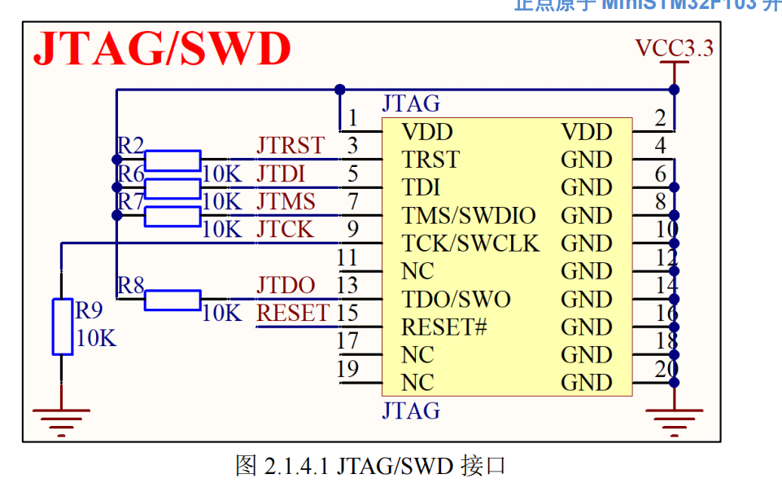

在 STM32 开发中，**SWD (Serial Wire Debug，串行调试接口)** 是最常用的程序烧录与调试方式。它是一种用于将编写好的代码下载到单片机芯片，并实时查看程序运行状态的通讯协议。相较于传统的 JTAG (Joint Test Action Group，一种引脚较多的工业标准调试接口)，SWD 模式更适合机器人战队的开发需求。其主要优点如下：

- **占用引脚极少**：SWD 最少仅需 3 根线即可工作，包括 **SWDIO** (数据线)、**SWCLK** (时钟线) 和 **GND** (地线)。在实际接线中，通常还会接入 **VCC** (电源线) 以确保信号稳定。
    
- **硬件资源利用率高**：由于 SWD 占用的引脚是 JTAG 的子集，使用 SWD 可以释放出更多的单片机引脚用于连接电机、传感器等其他外设。
    
- **官方推荐标准**：根据正点原子 (Alientek) 硬件手册建议，在设计产品和调试时应优先使用 SWD 模式，以规避 JTAG 引脚与其他外设功能冲突的问题。

