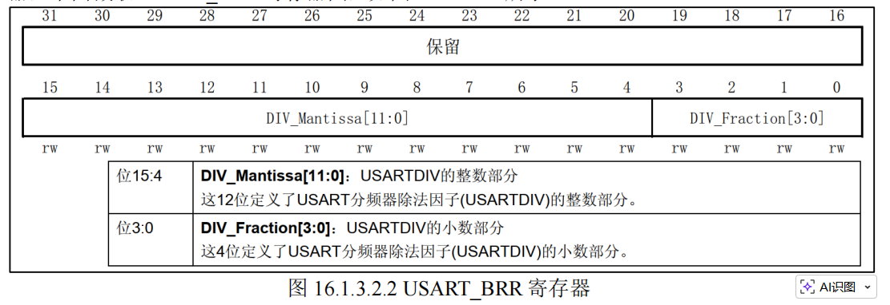

USART = Universal Synchronous / Asynchronous Receiver Transmitter, 通用同步/异步收发器，本质上是 MCU 的串行通信外设，负责将并行数据和串行数据相互转换

UART模式（异步），只需要TX和TX，非常简单，约定好波特率，就可以传输数据

波特率公式：
$$𝑏𝑎𝑢𝑑 = 𝑓𝑐𝑘  / （16 ∗ USARTDIV）$$
fck 是给串口的时钟
`USARTDIV` 是 **USART 内部波特率发生器使用的分频系数**，用 fck 经过一个分频，生成串口发送/接收所需的位节拍

举例：已知：
- 波特率 = 115200
- `fCK = 72 MHz`

则：

$$USARTDIV=\frac{72000000}{16\times115200}$$

先算分母：
16×115200=1843200

再算：

$$USARTDIV=72000000/1843200​=39.0625$$

所以这里：
- 整数部分 = `39`
- 小数部分 = `0.0625`
因此 BRR 里通常写成：
- `DIV_Mantissa = 39`
- `DIV_Fraction = 1`

USART_BRR存储方式：
- `DIV_Mantissa[11:0]`：整数部分
- `DIV_Fraction[3:0]`：小数部分，单位是 **1/16**

这是一个 无符号定点数（unsigned fixed-point number）

为什么过采样？因为接收端并不是看到电平变化就立刻把一位判成 `0` 或 `1`，而是会在**一个比特时间内多次采样**。假设一位数据持续时间是 `Tbit`，接收器把这一位再细分成 **16 个更小时间片**，也就是每位期间采样时钟频率是波特率的 **16 倍**，能够更准确找到一位的中间位置，提升抗噪，以及**允许时钟有一些误差**

假设发送端发了一个字节，线路空闲时为高电平。  
当开始发送时，先来一个**起始位**，电平从高变低。

接收器看到这个下降沿后，并不会马上认定后面的每一位，而是：

- 启动自己的“更快的采样时钟”
    
- 这个采样时钟通常是波特率的 16 倍
    
- 这样它就能估算出：
    
    - 起始位中心在哪里
        
    - 第 1 位数据中心在哪里
        
    - 第 2 位数据中心在哪里
        
    - …
        

因为**在每一位的中间采样最稳妥**：

- 不容易采到位与位切换时的毛刺
    
- 不容易因两端时钟略有偏差而采错
    

所以过采样本质上就是：

> **用更高频率的内部时钟，把每个比特切得更细，再尽量在“每位正中间”去判决数据。**

接收端如果时钟稍微有偏差，采样点可能慢慢漂移：

- 前几位还采在中间
    
- 到后几位就越来越接近边界
    
- 最后可能采到下一位去了
    

而且串口线上还可能有：

- 抖动
    
- 毛刺
    
- 噪声
    
- 上升下降沿不够陡
    

所以接收端需要一种办法：

- 更精细地定位位中心
    
- 更鲁棒地决定该位是 0 还是 1
    

这就是过采样。

接收器每1/16个比特时间就看一次输入线状态，当前到底离起始位开始过了多少“细小刻度”采样还能帮助**滤掉假起始位**

串口作为 STM32F103 的一个外设，其时钟由外设时钟使能寄存器控制，这里我们使用的

串口 1 是在 APB2ENR 寄存器的第 14 位

