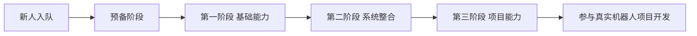

# Robocon 电控培养方案（总览）
第三周 I2C, ADC（遥控器）串口DMA收发，NRF，OLED（仓库驱动）
第四周遥控器

CAN协议/dji电机（2周）
底盘解算

本文件是当前培养方案的唯一入口，不再承载具体周任务细节。

详细执行内容请查看：

- [总则](./总则.md)
- [第二周任务](./第二周任务.md)
- [第一阶段任务（基础能力阶段）](./第一阶段任务.md)
- [第二阶段任务（系统整合阶段）](./第二阶段任务.md)
- [第三阶段任务（项目能力阶段）](./第三阶段任务.md)

## 一、培养路线图

能力主线：

1. 预备阶段：统一环境、工具链、代码规范、最小外设基础
2. 第一阶段：做扎实基础控制链与程序结构
3. 第二阶段：完成模板迁移、模块化设计和综合整合
4. 第三阶段：完成 CAN、电机、PID、底盘与联调接入

## 二、推进原则

- 任务仍可按周发布，但培养主线按阶段推进
- 前两周默认归入预备阶段，不再作为完整培养主线的前两周
- 晋级依据是当前阶段是否通关，不是自然周数是否结束
- 每个阶段统一采用：`通关线 / 提升线 / 预研线`
- 快的同学可进入预研线，慢的同学走补救路径，不做公开排名

## 三、阅读顺序

新人侧只需要按以下顺序阅读：

1. [培养方案](./培养方案.md)
2. [总则](./总则.md)
3. 当前所在阶段任务文档

学长侧如需查看历史版本和草稿，请进入 `培养/Legacy/`。

## 四、文档维护约定

- `培养方案.md` 只维护总览、阶段关系和阅读入口
- `总则.md` 只维护跨阶段统一规则
- 各阶段文档只维护该阶段执行要求、通关标准和验收问题
- 历史方案、讨论草稿和临时替代稿统一放入 `培养/Legacy/`
