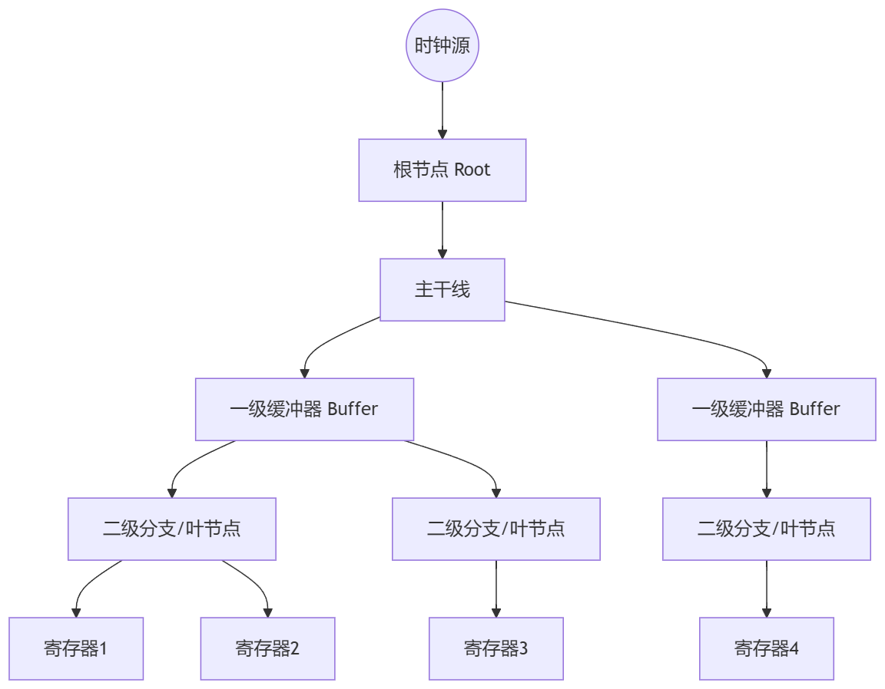

定时器分为三种，基本定时器，通用定时器，高级定时器
高级定时器单独挂在一个时钟树 

时钟树生成：
1. 预处理器宏定义约束 (stm32f1xx_hal_conf.h)
时钟源参数通过宏定义进行约束：
#define HSE_VALUE    8000000UL   // 外部高频振荡器 8MHz
#define HSI_VALUE    8000000UL   // 内部高频振荡器 8MHz  
#define LSI_VALUE    40000UL     // 内部低速振荡器 40kHz
#define LSE_VALUE    32768UL     // 外部低速振荡器 32.768kHz
这些值供HAL库计算各总线时钟频率。
2. 系统时钟初始化约束 (bsp_core.c)
通过 RCC_OscInitTypeDef 和 RCC_ClkInitTypeDef 结构体硬编码约束：
- 振荡器类型: HSE + PLL
- HSE分频: RCC_HSE_PREDIV_DIV1 (无分频)
- PLL倍频: RCC_PLL_MUL9 (9倍频 → 72MHz)
- 系统时钟源: PLL输出
- AHB分频: RCC_SYSCLK_DIV1 (72MHz)
- APB1分频: RCC_HCLK_DIV2 (36MHz)
- APB2分频: RCC_HCLK_DIV1 (72MHz)
3. 各外设时钟约束
通过 __HAL_RCC_*_CLK_ENABLE() 宏按需启用时钟，例如：
- __HAL_RCC_USART1_CLK_ENABLE() 
- __HAL_RCC_TIM3_CLK_ENABLE()
总结
该项目采用纯代码手动配置方式，而非CubeMX图形化配置。时钟树生成通过：
1. HAL配置文件定义晶振频率
2. bsp_core.c 硬编码PLL/分频参数
3. 各外设驱动独立使能所需时钟
如需修改时钟树（如改为HSI或不同PLL倍频），直接修改 bsp_core.c:25-40 行的结构体配置即可。