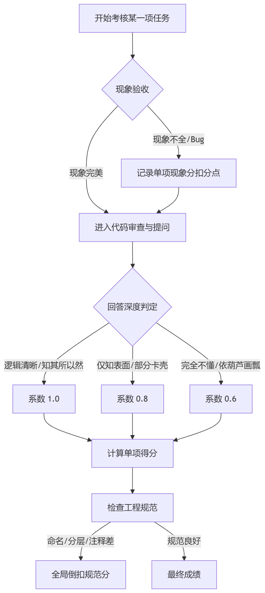

#### 1. PWM 呼吸灯 (Task 1)

**现象验收** 这里不仅是看灯亮不亮，重点在于**“呼吸”的质感**。你需要盯着LED看一个周期，如果只有简单的闪烁或者亮度发生阶梯状突变，直接扣除 **1分** 。

**代码与内核提问** 重点查看 `TIM` 的配置代码。

- **1.0 系数（深度掌握）：**
    
    - **提问：** “修改哪个参数能改变呼吸的频率？修改哪个改变亮度等级？”
        
    - **标准回答：** 能准确指出 `PSC`（预分频）和 `ARR`（重装载）决定频率，`CCR`（比较值）决定占空比。如果他能解释出“人眼视觉暂留效应与PWM频率的关系”，直接给满系数。
        
- **0.8 系数（基本理解）：**
    
    - 知道是改占空比，但对着代码解释 `ARR` 和 `PSC` 时支支吾吾，算不清楚频率。
        
- **0.6 系数（机械模仿）：**
    
    - 回答：“我照着例程改的数值，具体的没细算。”或者无法解释 `TIM_SetCompare` 函数的作用。
        

#### 2. 定时器运行时间记录 (Task 2)

**现象验收** 此项通常结合最后的OLED显示来验证。

**代码与内核提问** 审查中断服务函数 `TIMx_IRQHandler`。

- **1.0 系数：**
    
    - **提问：** “如果我想让时间记录精确到毫秒，或者记录超过几十天，你的变量类型够用吗？中断里要做什么操作？”
        
    - **标准回答：** 能够讨论 `uint32_t` 的溢出问题，或者解释中断里仅仅做计数（Flag++），主循环处理逻辑，体现出“中断快进快出”的思想。
        
- **0.6 - 0.8 系数：**
    
    - 在中断里写了大量的逻辑代码，或者不知道为什么要清除中断标志位。
        

---

### 第二阶段：核心存储业务逻辑（任务3, 4, 5, 6）

这是考核的重头戏（共30分），也是最容易出现“假动作”（看似做出来了但逻辑是错的）的地方。一定要进行**鲁棒性测试**（破坏性测试）。

#### 逻辑状态机与 SPI Flash 驱动

**现象验收（鲁棒性必测）**

1. **超长输入测试：** 在存储模式下，故意通过串口发送一条 **超过20字节** 的数据 。程序不应死机或乱码，应该截断或丢弃。若出错，扣 **3分**。
    
2. **断电测试：** 任务5要求查看存储列表。请务必**拔掉开发板电源重新上电**，再按 `WKUP` 。如果数据没了，说明他写的是 RAM 而不是 Flash，此项不得分。
    
3. **越界索引测试：** 任务6读取数据时，故意输入一个**不存在的编号**（比如存了3条，你输5） 。若程序跑飞，扣 **1分**。
    

**代码审查核心** 重点看他是如何管理 Flash 地址的。

- **Flash 扇区管理：** 这一块是很多新生的盲区。W25Qxx 系列 Flash 写入前必须擦除（Erase），且最小擦除单位通常是扇区（4KB）。
    
- **数据结构设计：** 查看他是否定义了结构体来管理每条消息（比如包含 `length`, `timestamp`, `content`），还是仅仅把一堆字符乱塞进去。
    

**深度提问分级**

- **1.0 系数（系统思维）：**
    
    - **提问：** “你是怎么保证下一条数据不覆盖上一条的？如果我掉电重启，你怎么知道下一条该从哪里开始写？”
        
    - **标准回答：** 能解释清楚这就需要一个“地址指针”或者“索引表”保存在 Flash 的特定位置（如首扇区）。能区分 `Sector Erase` 和 `Page Program` 的区别。
        
- **0.8 系数（功能实现）：**
    
    - 代码里用了写地址偏移，但对于“为什么要先擦除再写入”解释不深，或者没有处理好扇区边界的问题（虽然这次数据量小可能没触发Bug）。
        
- **0.6 系数（糊里糊涂）：**
    
    - **回答：** “我就设定每次地址加20。” —— 追问：“那重启后地址归零了怎么办？” 回答不上来。或者完全不知道 SPI 通信的时序（CPOL/CPHA）。
        

---

### 第三阶段：人机交互与综合状态（任务7）

**现象验收** OLED 必须显示四项内容：**运行时间、已存数目、Flash剩余容量、当前状态** 。

- **计分细节：** 这一项是组合分，少一项扣对应分数（时间2分，数目2分，容量4分，状态2分）。别忘了看剩余容量是不是动态变化的。
    

**代码与内核提问** 主要考察 IIC 协议的理解，特别是软件模拟 IIC。

- **1.0 系数：**
    
    - **提问：** “IIC 的起始信号和停止信号在电平上有什么区别？你的 IIC 延时函数如果去掉了会怎样？”
        
    - **标准回答：** 能画出 SCL 和 SDA 的时序图，解释 ACK 机制。
        
- **0.8 系数：**
    
    - 能说出 IIC 是两根线，知道要发地址，但对时序细节模糊。
        
- **0.6 系数：**
    
    - 直接复制的 OLED 驱动文件，甚至不知道哪个脚是 SCL，哪个是 SDA。
        

---

### 全局工程规范（Norms）

最后，别忘了那个“全局倒扣”的规则 。即使功能全对，代码写得像一团乱麻也要扣分。

**审查清单：**

1. **文件分层：** 是否有 `key.c`, `led.c`, `spi_flash.c` 等独立文件，还是全挤在 `main.c` 里？全挤在一起直接扣 **5分**，因为考核明确要求必须分层 。
    
2. **命名规范：** 变量叫 `a`, `b`, `flag1` 这种毫无意义的名字，或者缩进混乱，适当扣分。
    
3. **AI 成分：** 如果代码风格明显割裂（一部分像大师写的，一部分像小学生写的），挑那部分复杂的问。如果答不上来，按照规则**成绩作废** 。
    
